# Báo cáo Nghiên cứu Khoa học

**Tên đề tài:** MỘT HƯỚNG TIẾP CẬN TINH CHỈNH MÔ HÌNH NGÔN NGỮ LỚN VÀ TỐI ƯU CHUỖI TỪ ĐỒ THỊ CÂY CÚ PHÁP TRỪU TƯỢNG TRONG PHÁT HIỆN LỖ HỔNG HỢP ĐỒNG THÔNG MINH

**Tên tiếng Anh:** A NOVEL APPROACH TO FINE-TUNING LARGE LANGUAGE MODELS AND OPTIMIZING ABSTRACT SYNTAX TREE SEQUENCES FOR SMART CONTRACT VULNERABILITY DETECTION

---

## Tóm tắt (Abstract)

Sự phát triển mạnh mẽ của công nghệ blockchain đã kéo theo sự bùng nổ của hợp đồng thông minh (smart contract), đóng vai trò quản lý lượng tài sản số khổng lồ. Đi kèm với đó là rủi ro an ninh mạng gia tăng khi các lỗ hổng mã nguồn có thể dẫn đến thiệt hại kinh tế nghiêm trọng. Mặc dù các Mô hình ngôn ngữ lớn (LLMs) cho thấy tiềm năng xuất sắc trong việc phân tích mã nguồn, chúng vấp phải rào cản kỹ thuật lớn: giới hạn nghiêm ngặt về số lượng token đầu vào (ví dụ: 512 tokens đối với kiến trúc họ BERT). Trong khi đó, các hợp đồng thông minh được biểu diễn dưới dạng Đồ thị Cây cú pháp trừu tượng (AST) thường tạo ra những chuỗi đồ thị siêu dài, gây ra hiện tượng cắt xén ngẫu nhiên (truncation) làm mất đi các ngữ cảnh cốt lõi về lỗ hổng.

Nghiên cứu này đề xuất một luồng xử lý (pipeline) mới nhằm giải quyết vấn đề trên bằng cách tích hợp các kỹ thuật Trí tuệ nhân tạo có thể giải thích (Explainable AI - XAI) để tối ưu hóa đồ thị AST trước khi đưa vào LLM. Thay vì chỉ dựa vào một kỹ thuật, nghiên cứu tiến hành đánh giá và đối chiếu ba kịch bản trích xuất đặc trưng đồ thị: (1) Gradient Saliency (Đạo hàm ngược), (2) GNN Explainer (Tối ưu mặt nạ), và (3) GCN Embedding L2-Norm (Rút gọn không gian nhúng). Các thuật toán này chấm điểm quan trọng (importance scores) cho từng nút để cắt tỉa đồ thị ở các ngưỡng 80%, 50% và 20%. Đồ thị sau khi cô đặc được chuyển đổi thành chuỗi tuần tự bằng thuật toán duyệt theo chiều sâu (DFS) và tinh chỉnh qua 4 kiến trúc LLM (BERT, CodeBERT, DistilBERT, GPT-2) để phân loại đa nhãn 5 loại lỗ hổng phổ biến từ tập dữ liệu SoliAudit (10.555 mẫu). Kết quả thực nghiệm chỉ ra rằng, việc cắt tỉa đồ thị không chỉ loại bỏ nhiễu thành công mà còn cải thiện hiệu năng vượt bậc. Cụ thể, mô hình CodeBERT kết hợp với Gradient Saliency tại ngưỡng giữ lại 50% đạt chỉ số F1-Score cao nhất là **0.9244**. Đáng chú ý hơn, ở ngưỡng tối ưu hóa 20%, phương pháp này giúp thời gian huấn luyện và suy luận giảm tới **55.6%** mà vẫn duy trì F1-score trên mức 0.90. Nghiên cứu đóng góp một khung giải pháp toàn diện, mở ra hướng đi biến các LLM cồng kềnh thành các công cụ quét mã độc tĩnh thời gian thực (real-time scanner) cho các dự án Web3.

---

## 1. Giới thiệu (Introduction)

### 1.1 Đặt vấn đề

Công nghệ Blockchain đang chứng kiến sự phát triển liên tục và thu hút sự quan tâm đáng kể từ cả giới học thuật và thương mại. Hệ thống blockchain sở hữu những đặc tính ưu việt mang tính cách mạng như tính phân tán, tính bất biến và tính minh bạch. Những đặc điểm này không chỉ giới hạn trong lĩnh vực tiền mã hóa mà còn được triển khai rộng rãi trong chăm sóc sức khỏe, tài chính kỹ thuật số (DeFi), và quản lý chuỗi cung ứng. Nổi bật nhất trong số các nền tảng blockchain là Ethereum, nền tảng tiên phong đưa khái niệm hợp đồng thông minh (smart contract) vào thực tiễn. Hợp đồng thông minh là các đoạn mã tự thực thi được triển khai trên nền tảng blockchain, đóng vai trò kiểm soát một lượng lớn tiền tệ và các giao dịch tài chính tự động. 

Cùng với sự mở rộng của hệ sinh thái Web3, các hợp đồng thông minh ngày càng trở nên phức tạp, tích hợp nhiều tính năng và tương tác đa dạng với các giao thức khác nhau. Tuy nhiên, chính sự phức tạp này đã tạo ra một bề mặt tấn công rộng lớn, dẫn đến sự xuất hiện của nhiều lỗ hổng bảo mật ẩn sâu trong mã nguồn, rất khó phát hiện bằng mắt thường nhưng lại cực kỳ dễ bị khai thác bởi những tác nhân độc hại. Một ví dụ điển hình gây chấn động cộng đồng là vụ tấn công KyberSwap—một nền tảng giao dịch phi tập trung của Việt Nam—vào năm 2023. Trong sự cố này, tin tặc đã khéo léo khai thác các lỗ hổng liên quan đến reentrancy và tính toán thanh khoản để đánh cắp khối lượng tài sản ước tính lên tới 47 triệu USD. Kẻ tấn công ngày nay không ngừng nâng cấp các kỹ thuật tiên tiến, bao gồm làm rối mã (obfuscation) hay chèn mã (code injection) để vượt qua các cơ chế kiểm tra bảo mật thông thường. Những sự cố này không chỉ gây ra tổn thất kinh tế nặng nề mà còn làm xói mòn niềm tin của người dùng vào tính an toàn của hệ thống blockchain. Do đó, việc nghiên cứu và phát triển các phương pháp nhận diện lỗ hổng tự động, chính xác và hiệu quả cho hợp đồng thông minh đang trở thành một trong những ưu tiên hàng đầu của lĩnh vực an toàn thông tin mạng.

### 1.2 Động lực nghiên cứu

Trước thực trạng an ninh mạng đáng báo động trong không gian blockchain, nhiều phương pháp tiếp cận đã được đề xuất nhằm nhận diện sớm các lỗ hổng. Các phương pháp truyền thống như phân tích tĩnh (static analysis) hay thực thi tự động (symbolic execution) mặc dù phổ biến nhưng thường gặp hạn chế về tỷ lệ dương tính giả (false positive) cao và không thể nắm bắt được những ngữ nghĩa phức tạp trong mã. Gần đây, việc áp dụng các mô hình học sâu, đặc biệt là Mạng nơ-ron đồ thị (Graph Neural Network - GNN) đã mang lại những bước tiến đáng kể. Bằng cách biểu diễn hợp đồng thông minh dưới dạng Đồ thị Cây cú pháp trừu tượng (Abstract Syntax Tree - AST), GNN có thể khai thác được các mối quan hệ cấu trúc giữa các khối mã. 

Tuy nhiên, hiệu quả của các mô hình GNN phụ thuộc rất lớn vào chất lượng của biểu diễn đồ thị và đòi hỏi kiến thức chuyên môn sâu để tinh chỉnh. Sự xuất hiện của Mô hình ngôn ngữ lớn (Large Language Models - LLMs) như BERT, CodeBERT hay GPT đã cung cấp một hướng tiếp cận thay thế mạnh mẽ nhờ khả năng thấu hiểu ngữ cảnh và ngữ nghĩa sâu sắc của văn bản mã nguồn. Dù vậy, khi áp dụng LLM vào hợp đồng thông minh, một rào cản kỹ thuật nghiêm trọng xuất hiện: giới hạn về độ dài chuỗi đầu vào. Phần lớn các mô hình dựa trên kiến trúc Transformer (như BERT) chỉ cho phép độ dài tối đa là 512 tokens. Trong khi đó, thống kê thực tế cho thấy các đồ thị AST của hợp đồng thông minh trung bình chứa tới hơn 835 nút, tương đương với hàng nghìn tokens khi chuyển đổi thành chuỗi. Việc cắt cụt (truncate) chuỗi mã để vừa với giới hạn 512 tokens chắc chắn sẽ dẫn đến việc loại bỏ nhiều đoạn mã quan trọng, bao gồm cả những vị trí chứa lỗ hổng cốt lõi, làm suy giảm nghiêm trọng khả năng phát hiện của mô hình.

Động lực chính của nghiên cứu này xuất phát từ nhu cầu giải quyết mâu thuẫn giữa kích thước khổng lồ của biểu diễn mã nguồn và giới hạn tài nguyên của các mô hình ngôn ngữ lớn. Thay vì cắt bỏ thông tin một cách ngẫu nhiên hay chỉ lấy phần đầu của mã, nghiên cứu hướng tới việc tạo ra một cơ chế "lọc" thông minh, có khả năng đánh giá mức độ quan trọng của từng phần tử trong mã nguồn, từ đó chỉ giữ lại những thành phần thực sự cần thiết cho việc phân loại lỗ hổng.

### 1.3 Mục tiêu nghiên cứu

Nghiên cứu này được thực hiện với ba mục tiêu cốt lõi sau:

**Thứ nhất**, xây dựng một luồng xử lý (pipeline) thông minh chuyển đổi mã nguồn Solidity phi cấu trúc thành Đồ thị Cây cú pháp trừu tượng (AST), sau đó biểu diễn lại dưới dạng chuỗi tuần tự tương thích hoàn toàn với đầu vào của các Mô hình ngôn ngữ lớn (LLM).

**Thứ hai**, triển khai và so sánh hiệu năng của ba kỹ thuật Trí tuệ nhân tạo có thể giải thích (Explainable AI - XAI) khác nhau: (1) Tính toán Đạo hàm ngược (Gradient Saliency), (2) Tối ưu hóa mặt nạ đồ thị (GNN Explainer), và (3) Chuẩn L2 của không gian nhúng (GCN Embedding L2-Norm). Việc ứng dụng ba cơ chế này nhằm lượng hoá mức độ quan trọng của các nút trong AST để tiến hành cắt tỉa (pruning) ở ba mức độ: 80%, 50% và 20%.

**Thứ ba**, phân tích đa chiều tác động của luồng xử lý trên 4 kiến trúc LLM đa dạng (BERT, DistilBERT, CodeBERT và GPT-2) dựa trên bài toán phân loại đa nhãn. Mục tiêu hướng tới không chỉ là tối ưu hóa F1-Score mà còn là việc giảm thiểu tối đa chi phí huấn luyện và thời gian suy luận, làm tiền đề cho việc tích hợp vào các công cụ thực tế.

### 1.4 Phạm vi nghiên cứu

Để đảm bảo tính khả thi và đánh giá chuyên sâu, nghiên cứu được thiết lập với các ranh giới sau:
- **Tập dữ liệu:** Phân tích trực tiếp trên tập dữ liệu SoliAudit chứa 10.555 mẫu hợp đồng thông minh đã được xử lý thành đồ thị AST. Dữ liệu tập trung giải quyết phân loại 5 lỗ hổng nghiêm trọng nhất thuộc chuẩn DASP v2: Lỗi số học (Arithmetic), Không kiểm tra giá trị trả về (Unchecked Return), Tấn công từ chối dịch vụ (DoS), Thao túng thời gian (Time manipulation), và Tấn công chui lại (Reentrancy).
- **Phạm vi mô hình:** Nghiên cứu so sánh chéo 4 biến thể LLM: một mô hình xử lý ngôn ngữ truyền thống (BERT), một phiên bản nén nhẹ (DistilBERT), một mô hình chuyên biệt cho mã nguồn (CodeBERT), và một mô hình sinh tự hồi quy (GPT-2).
- **Phạm vi kỹ thuật XAI:** Nghiên cứu chỉ tập trung khai thác điểm số giải thích (Importance Scores) trên mạng GCN (Graph Convolutional Network) để trích xuất đặc trưng cấu trúc (Structural Features) mức AST, chưa tính tới việc mở rộng cho các luồng dữ liệu cấp độ bytecode (Data Dependency Graph) cực kỳ phức tạp.

## 2. Cơ sở lý thuyết và công trình liên quan (Related Work)

### 2.1 Hợp đồng thông minh và Lỗ hổng bảo mật

Hợp đồng thông minh (Smart Contract) là các chương trình máy tính tự động thực thi được lưu trữ trên một mạng lưới blockchain (như Ethereum). Chúng hoạt động dựa trên các điều khoản đã được định nghĩa trước mà không cần thông qua bên thứ ba trung gian. Mặc dù mang lại tính minh bạch và tự động hóa cao, mã nguồn hợp đồng thông minh (thường được viết bằng ngôn ngữ Solidity) chứa đựng nhiều rủi ro bảo mật tiềm ẩn. Vì tính chất bất biến của blockchain, một khi hợp đồng đã được triển khai, mã nguồn không thể bị thay đổi để vá lỗi, khiến mọi lỗ hổng trở thành mục tiêu béo bở cho hacker.

Nghiên cứu này tập trung vào 5 loại lỗ hổng phổ biến nhất theo phân loại của chuẩn DASP v2 (Decentralized Application Security Project):
1. **Arithmetic (Lỗi số học):** Xảy ra khi các phép toán cộng trừ nhân chia vượt quá giới hạn của kiểu dữ liệu (Overflow/Underflow), dẫn đến kết quả tính toán sai lệch, thường bị lợi dụng để thao túng số dư token.
2. **Unchecked Return Values For Low Level Calls:** Khi một hợp đồng gọi đến hợp đồng khác thông qua các lệnh gọi mức thấp (như `call`, `send`, `delegatecall`) nhưng không kiểm tra giá trị trả về (`true`/`false`). Nếu cuộc gọi thất bại nhưng hợp đồng gốc vẫn tiếp tục thực thi, nó có thể dẫn đến trạng thái không nhất quán.
3. **Denial of Service (DoS):** Tấn công từ chối dịch vụ nhằm mục đích vô hiệu hóa hợp đồng, thường được thực hiện bằng cách làm cạn kiệt lượng Gas cho phép hoặc thao túng các vòng lặp khiến hợp đồng không thể hoàn thành giao dịch.
4. **Time Manipulation (Thao túng thời gian):** Xảy ra khi logic của hợp đồng phụ thuộc vào `block.timestamp`. Miner có khả năng tinh chỉnh nhẹ timestamp của khối, qua đó thao túng các hàm sinh số ngẫu nhiên hoặc các điều kiện thời gian để trục lợi.
5. **Reentrancy (Tấn công chui lại):** Lỗ hổng nguy hiểm nhất, cho phép kẻ tấn công gọi lại chính hàm đang thực thi trước khi trạng thái của hàm đó (như số dư tài khoản) được cập nhật. Kẻ tấn công có thể rút cạn tiền của hợp đồng nạn nhân thông qua một vòng lặp gọi đệ quy liên tục.

### 2.2 Đồ thị Cây cú pháp trừu tượng (AST)

Để máy tính có thể "hiểu" và phân tích cấu trúc của mã nguồn, các đoạn mã Solidity thường được biên dịch và biểu diễn dưới dạng đồ thị. Một trong những dạng biểu diễn phổ biến nhất là Đồ thị Cây cú pháp trừu tượng (Abstract Syntax Tree - AST). 
- **AST** là một biểu diễn dạng cây của cấu trúc mã nguồn mức cao, nơi mỗi nút (node) biểu diễn một cấu trúc ngữ pháp như khai báo biến, biểu thức điều kiện, hoặc vòng lặp. 

Trong nghiên cứu này, mã nguồn hợp đồng thông minh được chuyển đổi thành định dạng AST (dưới dạng file JSON), cung cấp một bức tranh toàn cảnh về mặt cú pháp. Việc biểu diễn dưới dạng đồ thị giúp giữ lại được các đặc trưng ngữ nghĩa quan trọng mà việc chỉ đọc mã nguồn dưới dạng văn bản thuần túy (plain text) có thể bỏ sót, một hướng tiếp cận đã được chứng minh tính hiệu quả trong nhiều nghiên cứu về phát hiện lỗ hổng và làm rối mã (Wu et al., 2021; Zhang et al., 2023).

### 2.3 Mô hình ngôn ngữ lớn (LLM) trong phân tích mã nguồn

Sự ra đời của kiến trúc Transformer đã mở ra kỷ nguyên của các Mô hình ngôn ngữ lớn (LLMs). Không chỉ xuất sắc trong việc xử lý ngôn ngữ tự nhiên, các mô hình này còn cho thấy khả năng vượt trội trong việc thấu hiểu mã nguồn (Code Intelligence). Các mô hình như BERT (Bidirectional Encoder Representations from Transformers), CodeBERT (được huấn luyện trước trên dữ liệu mã nguồn đa ngôn ngữ), và DistilBERT (phiên bản rút gọn của BERT) đều có khả năng chuyển đổi chuỗi mã nguồn thành các vector nhúng (embeddings) mang ngữ nghĩa sâu sắc. 

Bên cạnh đó, các mô hình sinh văn bản tự hồi quy (autoregressive) như GPT-2 cũng được ứng dụng để đánh giá khả năng phân loại. Tuy nhiên, hạn chế lớn nhất của họ mô hình dựa trên Transformer (đặc biệt là BERT) là kích thước cửa sổ ngữ cảnh (context window) bị giới hạn cứng ở 512 tokens. Mọi token vượt quá giới hạn này đều bị mô hình loại bỏ (truncate), làm mất mát lượng lớn thông tin. GPT-2 có giới hạn nhỉnh hơn là 1024 tokens, nhưng vẫn chưa đủ để xử lý toàn bộ đồ thị AST của những hợp đồng thông minh có quy mô hàng chục nghìn nút.

### 2.4 Tích hợp XAI trong phân tích Đồ thị mã nguồn

Trí tuệ nhân tạo có thể giải thích (Explainable AI - XAI) là một tập hợp các kỹ thuật thiết yếu nhằm minh bạch hóa quá trình suy luận của các mô hình hộp đen (black-box) phức tạp. Khi làm việc với dữ liệu đồ thị phi tuyến, việc biết được một nút (node) ảnh hưởng như thế nào đến quyết định phân loại là chìa khóa để tinh giản dữ liệu. Nghiên cứu này kết hợp 3 trường phái XAI khác nhau để khai thác thông tin từ Mạng nơ-ron đồ thị (GCN):

1. **Gradient Saliency (Đạo hàm ngược):** Một kỹ thuật cổ điển nhưng mạnh mẽ dựa trên việc tính toán đạo hàm ngược từ đầu ra của hàm mất mát (loss) về không gian đặc trưng đầu vào. Điểm số của nút được định lượng bằng chuẩn L2 của tích số đặc trưng và đạo hàm. Những nút có gradient lớn nhất chỉ ra rằng một thay đổi nhỏ ở chúng sẽ ảnh hưởng cực lớn đến quyết định có lỗ hổng hay không.
2. **GNN Explainer (Mask Optimization):** Một phương pháp tiên tiến sử dụng giá trị SHAP (SHapley Additive exPlanations) dựa trên lý thuyết trò chơi của Lundberg & Lee (2017). Thuật toán này học cách tạo ra một "mặt nạ đồ thị con" (subgraph mask) nhằm cực đại hóa lượng thông tin tương hỗ (Mutual Information) giữa đồ thị ban đầu và đồ thị bị che. Các nút được giữ lại đại diện cho các nguyên nhân (causal features) sinh ra dự đoán.
3. **Embedding L2-Norm (Xếp hạng không gian nhúng):** Một kỹ thuật lấy cảm hứng từ cấu trúc phân tầng. Thay vì phụ thuộc vào nhãn hay đạo hàm, kỹ thuật này chỉ truyền thông tin qua các lớp chập để nắm bắt cấu trúc lân cận 2-hop (2-hop neighborhood). Các nút có vector nhúng (embedding vector) chứa năng lượng lớn nhất (đo lường bằng chuẩn L2) được coi là các nút trọng tâm (hub nodes) chi phối luồng điều khiển của hàm.

### 2.5 Các nghiên cứu liên quan

Trong bối cảnh phát hiện lỗ hổng hợp đồng thông minh, các phương pháp tiếp cận đã trải qua nhiều giai đoạn phát triển. Ban đầu, các công cụ phân tích tĩnh (Static Analysis) như Oyente, Securify, Mythril hay Slither được sử dụng rộng rãi dựa trên việc định nghĩa sẵn các tập luật (rules) cứng. Mặc dù tốc độ nhanh, các công cụ này thiếu linh hoạt, dễ sinh ra các cảnh báo sai (false positives) và không thể phát hiện các lỗ hổng mang tính logic phức tạp.

Giai đoạn tiếp theo chứng kiến sự lên ngôi của Học sâu (Deep Learning), đặc biệt là Mạng nơ-ron đồ thị (GNN). Nghiên cứu của Liu et al. (2021) đã chứng minh rằng GNN kết hợp với kiến thức chuyên gia có thể mang lại kết quả phân loại lỗ hổng vượt trội so với phân tích tĩnh truyền thống hay các mạng RNN, LSTM. Tuy nhiên, GNN rất khó để huấn luyện, khó tối ưu hóa và thường hoạt động như một "hộp đen", thiếu tính diễn giải.

Gần đây, việc đưa LLM vào phân tích mã nguồn blockchain đang trở thành xu hướng mới. Tuy nhiên, sự xung đột giữa độ dài cực lớn của biểu diễn mã và giới hạn 512 tokens của các mô hình cơ sở vẫn là một điểm nghẽn chưa có giải pháp tối ưu. Hầu hết các nghiên cứu hiện tại phải chấp nhận việc cắt ngắn mã hoặc chỉ lấy một số hàm nhất định. Nghiên cứu này lấp đầy khoảng trống đó bằng cách đề xuất một cơ chế "giảm chiều dữ liệu có hướng đích" (guided dimensionality reduction) thông qua XAI, kết hợp điểm mạnh của biểu diễn đồ thị, khả năng giải thích của GNN Explainer và sức mạnh phân tích ngữ nghĩa của LLM.

## 3. Phương pháp (Methodology)

### 3.1 Tổng quan Pipeline

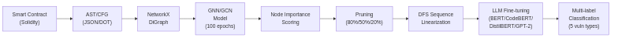

Hệ thống đề xuất hoạt động dựa trên một pipeline (luồng xử lý) khép kín, được thiết kế để chuyển đổi mã nguồn phi cấu trúc thành dữ liệu tối ưu cho Mô hình ngôn ngữ lớn (LLM). Cụ thể, luồng xử lý bắt đầu bằng việc chuyển đổi mã nguồn Solidity thành Đồ thị Cây cú pháp trừu tượng (AST) dưới dạng JSON, kế thừa tư tưởng từ phương pháp biểu diễn học máy của Wu et al. (2021). Đồ thị này sau đó được nạp vào đối tượng `DiGraph` của thư viện NetworkX để trích xuất các đặc trưng hình học. Điểm cốt lõi của pipeline nằm ở bước huấn luyện một mô hình Graph Convolutional Network (GCN) trong 100 epochs, từ đó ứng dụng GNN Explainer để tính toán điểm số quan trọng (Node Importance Scoring) cho từng nút dựa trên phương pháp tối ưu hoá mặt nạ học được (tương tự như cách SHAP định lượng giá trị đóng góp của Lundberg & Lee, 2017). Các nút không mang thông tin nhạy cảm về lỗ hổng sẽ bị loại bỏ thông qua cơ chế cắt tỉa (Pruning) ở các ngưỡng 80%, 50% hoặc 20%. Cuối cùng, đồ thị đã được cô đặc sẽ trải qua thuật toán duyệt theo chiều sâu (DFS) để chuyển đổi ngược lại thành dạng chuỗi một chiều (1D Sequence) trước khi được tinh chỉnh (fine-tuning) qua các LLMs (BERT, DistilBERT, CodeBERT, GPT-2) cho bài toán phân loại đa nhãn 5 loại lỗ hổng.

### 3.2 Tập dữ liệu và Môi trường thực nghiệm

#### Tập dữ liệu SoliAudit

Nghiên cứu này sử dụng tập dữ liệu **SoliAudit** (đã được dán nhãn theo chuẩn DASP v2 bởi Liao et al., 2019), bao gồm mã nguồn của hàng ngàn hợp đồng thông minh đã được biên dịch thành cấu trúc đồ thị. Tập dữ liệu được phân chia theo tỷ lệ chuẩn: tập huấn luyện (Train set: 8444 mẫu) và tập kiểm thử (Test set: 2111 mẫu). Bài toán đặt ra là phân loại đa nhãn (Multi-label classification) cho 5 loại lỗ hổng bảo mật cốt lõi. 

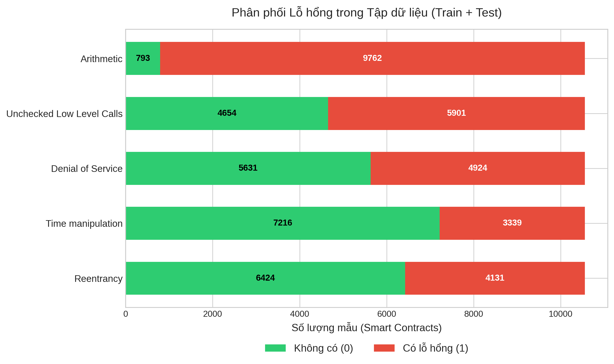

Biểu đồ trên thể hiện sự phân bổ không đồng đều (imbalanced distribution) đặc trưng của dữ liệu bảo mật thực tế: Lỗi số học (Arithmetic) chiếm ưu thế áp đảo với hơn một nửa số hợp đồng mắc lỗi, trong khi đó Thao túng thời gian (Time manipulation) lại khá khan hiếm. Chính sự mất cân bằng nghiêm trọng này là lý do thiết yếu giải thích tại sao hệ thống bắt buộc phải sử dụng Micro/Macro F1-Score làm thước đo hiệu suất chính ở mục 4 để có cái nhìn công bằng nhất.

#### Phần cứng

| Cấu hình | BERT / CodeBERT / DistilBERT | GPT-2 |
|----------|------------------------------|-------|
| **GPU** | Tesla P100-PCIE-16GB (Kaggle) | NVIDIA RTX 4090 24GB (Vast.ai) |
| **Python** | 3.12 | 3.12 |
| **PyTorch** | 2.8+cu126 | 2.8+cu126 |
| **CUDA** | Có | Có |

> [!NOTE]
> GPT-2 **chỉ** chạy trên RTX 4090 (Vast.ai), thời gian train/inference **không so sánh trực tiếp** với nhóm BERT (P100).

#### Thư viện chính

| Thư viện | Phiên bản | Vai trò |
|----------|-----------|---------|
| `torch` | ≥2.9 | Deep learning framework |
| `torch-geometric` | ≥2.7 | GCNConv, GNNExplainer, graph data |
| `transformers` | ≥4.57 | BERT, CodeBERT, DistilBERT, GPT-2 (HuggingFace) |
| `networkx` | ≥3.5 | Biểu diễn và xử lý đồ thị AST |
| `datasets` | ≥2.16 | Tải/upload dataset từ HuggingFace Hub |
| `scikit-learn` | ≥1.7 | Metrics: classification_report, precision/recall/f1 |
| `pandas` | ≥2.3 | Xử lý dữ liệu dạng bảng (CSV) |
| `numpy` | ≥2.3 | Tính toán số học |
| `python-dotenv` | ≥1.0 | Quản lý biến môi trường (API tokens) |

### 3.3 Kiến trúc mô hình GNN (GNNClassifier) — Dùng chung cho cả 3 kịch bản

Cả 3 phương pháp tính node importance đều sử dụng **cùng một `GNNClassifier`** được huấn luyện 100 epochs trên tập train.

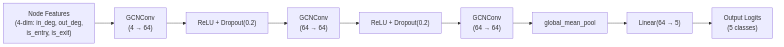

Dựa trên cấu trúc đồ thị mã nguồn, kiến trúc mạng `GNNClassifier` được thiết kế tối giản nhưng hiệu quả, lấy cảm hứng từ thành công của mạng GCN trong phân tích hợp đồng thông minh (Liu et al., 2021; Sendner et al., 2023). Sơ đồ kiến trúc phía trên minh hoạ quy trình biến đổi đặc trưng nút: Mỗi nút ban đầu được biểu diễn bằng một vector 4 chiều đơn giản bao gồm bậc vào (in-degree), bậc ra (out-degree), cờ nút vào (is_entry) và cờ nút ra (is_exit). Thông tin này được truyền qua 3 lớp tích chập đồ thị (GCNConv). Ở mỗi lớp GCNConv, đặc trưng của một nút được tổng hợp với đặc trưng của các nút lân cận, giúp mô hình nắm bắt được ngữ cảnh cấu trúc trong phạm vi 3 bước nhảy (3-hop neighborhood). Sau lớp chập thứ nhất và thứ hai, hệ thống áp dụng hàm kích hoạt ReLU kết hợp với Dropout (tỷ lệ 0.2) nhằm tăng tính phi tuyến tính và chống hiện tượng quá khớp (overfitting). Tại lớp cuối cùng, tất cả các vector đặc trưng nút (kích thước 64 chiều) sẽ được tổng hợp lại thành một vector duy nhất đại diện cho toàn bộ hợp đồng thông qua hàm Global Mean Pooling. Cuối cùng, một lớp tuyến tính (Linear layer) đóng vai trò bộ phân loại sẽ ánh xạ vector 64 chiều này về không gian 5 chiều, tương ứng với logits của 5 loại lỗ hổng (Multi-label).

| Tham số | Giá trị |
|---------|---------|
| Số layer GCNConv | 3 |
| Hidden channels | 64 |
| Node features | 4 (in_degree, out_degree, is_entry, is_exit) |
| Num classes | 5 (multi-label) |
| Dropout | 0.2 |
| Pooling | Global Mean Pooling |
| GNN model training epochs | **100** |
| Learning rate (GNN) | 0.01 |
| Batch size (GNN) | 32 |
| Loss function (GNN) | BCEWithLogitsLoss |
| GNN Explainer epochs (per sample) | **100** (iterative mask optimization) |

### 3.4 Ba phương pháp tính Node Importance

#### Kịch bản 1: AST + GNN (No Explainer) — Phương pháp Gradient Saliency (Bản đồ nổi bật dựa trên Gradient)

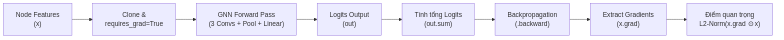

Thay vì sử dụng một thuật toán giải thích phức tạp, kịch bản này đánh giá mức độ quan trọng của các nút (node) thông qua việc phân tích trực tiếp dòng chảy đạo hàm (gradient flow) của mô hình GNNClassifier. Sơ đồ trên minh hoạ chi tiết quy trình xử lý của hàm `compute_node_importance_gnn_no_explainer`:
Đầu tiên, đồ thị được nạp vào mô hình với ma trận đặc trưng của các nút (`x`) được sao chép và bật cờ theo dõi đạo hàm (`requires_grad=True`). Đồ thị sau đó thực hiện một **Forward Pass** hoàn chỉnh qua toàn bộ mạng GNN (bao gồm 3 lớp GCNConv, lớp Global Pooling và Linear Head) để tạo ra các giá trị logits dự đoán cho 5 loại lỗ hổng.
Hệ thống sau đó tính tổng tất cả các logits này thành một giá trị vô hướng duy nhất và thực hiện lan truyền ngược (**Backpropagation**). Đạo hàm thu được tại bước ma trận đầu vào (`x.grad`) sẽ được trích xuất và nhân phần tử (element-wise) với chính giá trị đặc trưng ban đầu để tạo ra một bản đồ nổi bật. Cuối cùng, chuẩn L2 (L2-norm) của vector đặc trưng tại mỗi nút được tính toán để đóng vai trò là "điểm số quan trọng". Các nút có điểm cao là những nút mà sự thay đổi nhỏ của chúng sẽ gây tác động lớn nhất đến tổng logits đầu ra của mô hình.

#### Kịch bản 2: AST + GNN Explainer — Tối ưu hóa Mặt nạ lặp (Iterative Mask Optimization)

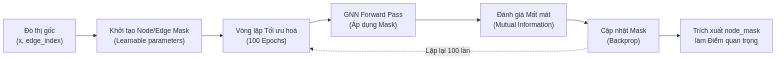

Kịch bản này triển khai thuật toán GNN Explainer chuẩn mực từ thư viện PyTorch Geometric. Đây là một phương pháp tiếp cận theo hướng tối ưu cục bộ (local optimization). Như luồng chạy minh hoạ ở trên, bên trong hàm `compute_node_importance_gnn`, hệ thống khởi tạo các "mặt nạ" (mask) có thể học được cho cả nút và cạnh dưới dạng tham số của thuật toán (`node_mask_type="object"`).
Điểm khác biệt cốt lõi là đối với *mỗi một hợp đồng thông minh*, GNN Explainer phải thực hiện một **vòng lặp tối ưu hoá độc lập kéo dài 100 epochs**. Trong mỗi vòng lặp, một Forward Pass được thực hiện với mặt nạ đang học, sau đó mô hình đánh giá mất mát bằng cách tối đa hóa thông tin tương hỗ (Mutual Information) giữa dự đoán của đồ thị gốc và đồ thị bị áp mặt nạ. Sai số này được lan truyền ngược để cập nhật lại mặt nạ. Quy trình lặp lại 100 lần trước khi trích xuất giá trị hội tụ của `node_mask` làm điểm số quan trọng. Mặc dù có cơ sở toán học vững chắc, nó đòi hỏi chi phí tính toán và thời gian rất lớn do cơ chế huấn luyện lặp này.

#### Kịch bản 3: AST + GCN Explainer — Phương pháp Đánh giá Nhúng GCN (GCN Embedding L2-Norm)

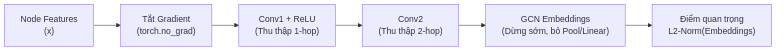

Nhằm giải quyết nút thắt về thời gian chạy khổng lồ của GNN Explainer, kịch bản 3 đưa ra một phương pháp tiếp cận cực kỳ nhẹ và nhanh chóng bằng cách khai thác trực tiếp không gian nhúng (embedding space) của mô hình GCN. Dựa vào đồ thị luồng phía trên, trong hàm `compute_node_importance_gcn`, bước đầu tiên hệ thống thực hiện là **tắt hoàn toàn quá trình tính toán đạo hàm** (`torch.no_grad()`). 
Thay vì chạy qua toàn bộ kiến trúc mô hình, đồ thị thực hiện một Forward Pass bị dừng sớm (early stopping): tín hiệu chỉ đi qua lớp `conv1` (tổng hợp thông tin 1-hop neighborhood), qua hàm kích hoạt ReLU và đi tiếp qua `conv2` (tổng hợp thông tin 2-hop). Mô hình bỏ qua hoàn toàn lớp gộp (Pooling) và lớp phân loại tuyến tính. Kết quả thu được là một ma trận nhúng GCN chứa các vector đại diện cấu trúc đồ thị tinh khiết cho từng nút. Điểm số quan trọng được tính đơn giản bằng chuẩn L2 của vector nhúng này (`x.norm(dim=1)`). Phương pháp này bỏ qua toàn bộ vòng lặp huấn luyện lặp, cung cấp một cơ chế xếp hạng nút siêu tốc mà vẫn phản ánh được luồng dữ liệu bất thường.

#### Bảng tổng kết so sánh 3 phương pháp phân tích Node Importance

| Tiêu chí | GNN (No Explainer) | GNN Explainer | GCN Explainer |
|----------|:---:|:---:|:---:|
| **Tốc độ tạo tập dữ liệu** | Trung bình ❌<br>*(Cần Forward & Backward pass)* | Rất chậm ❌<br>*(Cần 100 epochs lặp/mẫu)* | Siêu tốc ✅<br>*(Chỉ Forward qua 2 lớp)* |
| **Tính toán Đạo hàm (Gradients)** | Có ✅<br>*(Lấy đạo hàm `x.grad`)* | Có ✅<br>*(Tối ưu hoá `node_mask`)* | Không ❌<br>*(`torch.no_grad()`)* |
| **Có xét đến Output (Logits)** | Có ✅<br>*(Phản ánh ảnh hưởng lên dự đoán)* | Có ✅<br>*(Bảo toàn dự đoán)* | Không ❌<br>*(Chỉ xét cấu trúc đồ thị)* |
| **Nguy cơ Overfitting cục bộ** | Thấp ✅ | Cao ❌<br>*(Do tối ưu riêng từng đồ thị)* | Thấp ✅ |
| **Hiệu suất tổng thể (F1-Score)** | Tốt nhất ✅ | Kém nhất ❌ | Tốt thứ hai ✅ |

### 3.5 Minh họa thực tế: AST → Sequence Conversion

**Contract:** `0xa82749c94ab7f921725624fb90e7600216169597` (Label: **Arithmetic**)

**Mã nguồn (Solidity):**
```solidity
pragma solidity ^0.4.19;
contract Counter {
    uint public counter;
    function increment() public { counter++; }
}
```

**Biểu diễn Đồ thị AST gốc:**
Đồ thị dưới đây là cấu trúc AST trực quan của đoạn mã trên, thể hiện luồng phân cấp từ gốc (`SourceUnit`) xuống các nút lá.

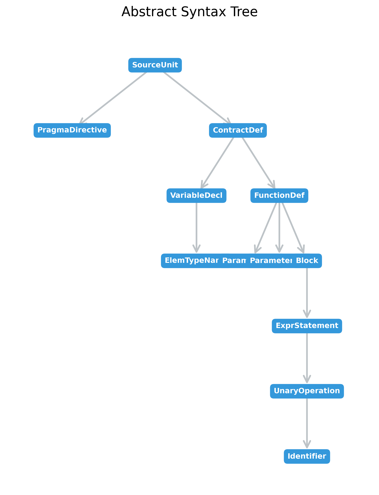

Chuỗi tuần tự (Sequence) ban đầu của AST gồm 13 nodes: `SourceUnit → PragmaDirective → ContractDefinition → VariableDeclaration → ElementaryTypeName → FunctionDefinition → ParameterList × 2 → Block → ExpressionStatement → UnaryOperation → Identifier`

**Before Optimization (cả 3 phương pháp đều giống nhau):**
```
SourceUnit PragmaDirective ContractDefinition VariableDeclaration ElementaryTypeName
FunctionDefinition ParameterList ParameterList Block ExpressionStatement UnaryOperation Identifier
```

**Sau pruning — so sánh 3 phương pháp:**

| Ngưỡng | GNN (no explainer) | GNN Explainer | GCN Explainer |
|--------|-------------------|---------------|---------------|
| **80%** | `SourceUnit ContractDefinition VariableDeclaration FunctionDefinition ParameterList ParameterList Block ExpressionStatement UnaryOperation` | `SourceUnit PragmaDirective VariableDeclaration ElementaryTypeName FunctionDefinition Block ExpressionStatement UnaryOperation Identifier` | `VariableDeclaration ElementaryTypeName FunctionDefinition ParameterList ParameterList Block ExpressionStatement UnaryOperation Identifier` |
| **50%** | `SourceUnit ContractDefinition FunctionDefinition Block ExpressionStatement UnaryOperation` | `VariableDeclaration ElementaryTypeName FunctionDefinition Block ExpressionStatement Identifier` | `ElementaryTypeName ParameterList ParameterList ExpressionStatement UnaryOperation Identifier` |
| **20%** | `SourceUnit ContractDefinition` | `VariableDeclaration ElementaryTypeName` | `ElementaryTypeName Identifier` |

**Nhận xét:**
- **GNN (không có Explainer)** ưu tiên giữ node structural cao (SourceUnit, ContractDefinition) do gradient saliency phản ánh ảnh hưởng lên output → luôn giữ root nodes
- **GNN Explainer** giữ PragmaDirective ở 80% (node mask optimization giữ "anchor" nodes) nhưng ở 50% bắt đầu mất cấu trúc contract-level
- **GCN Explainer** mất SourceUnit/ContractDefinition ngay từ 80% — vì embedding L2-norm ưu tiên nodes có degree cao hơn (VariableDeclaration, ParameterList) thay vì root
- Ở 20%, cả 3 chỉ giữ 2 nodes — quá ít để phản ánh lỗ hổng cụ thể, nhưng vẫn giữ thông tin kiểu dữ liệu (ElementaryTypeName)

### 3.6 Thống kê Token Count — So sánh 3 kịch bản (Train set, 8444 samples)

| Kịch bản | Setting | Mean tokens | >512 (%) | >1024 (%) |
|----------|---------|-------------|----------|-----------|
| **GNN (no explainer)** | Before | 1294.2 | 94.1% | 84.3% |
| | 80% | 1041.8 | 92.5% | 64.2% |
| | 50% | 638.1 | 84.9% | 0.0% |
| | 20% | 255.4 | 0.0% | 0.0% |
| **GNN Explainer** | Before | 1295.5 | 94.1% | 84.3% |
| | 80% | 1039.3 | 92.2% | 63.7% |
| | 50% | 653.5 | 84.1% | 0.0% |
| | 20% | 266.9 | 0.0% | 0.0% |
| **GCN Explainer** | Before | 1270.1 | 94.1% | 84.3% |
| | 80% | 1003.2 | 92.1% | 62.7% |
| | 50% | 626.3 | 70.3% | 0.3% |
| | 20% | 270.5 | 0.0% | 0.0% |

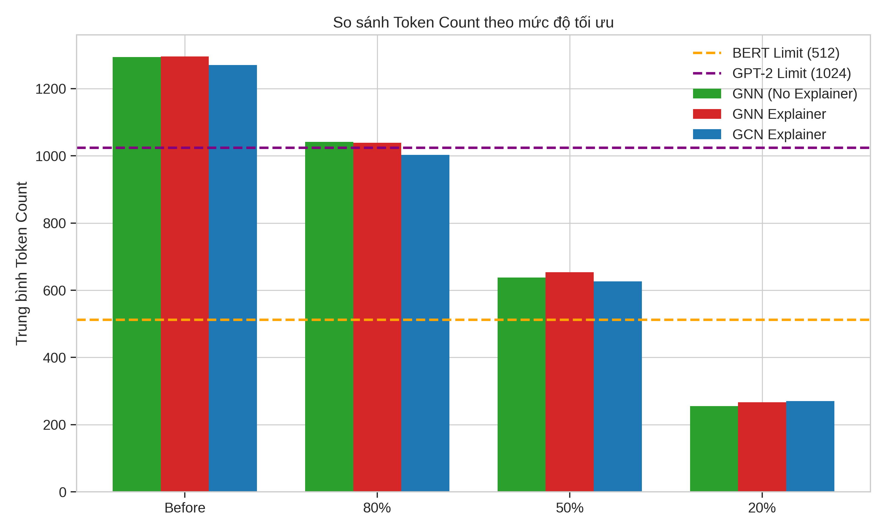

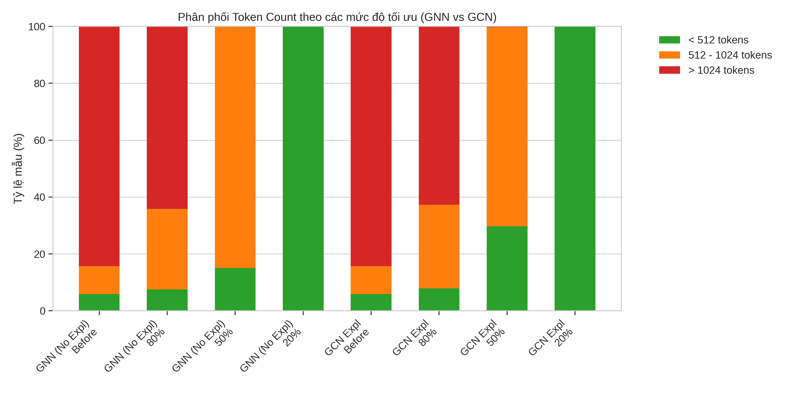

**Nhận xét:** GCN Explainer giảm token tốt nhất ở 50% (chỉ 70.3% >512 vs 84.9% GNN). Ở 20%, cả 3 đều 0% >512.

Sự phân phối token này giải thích rất nhiều về hiệu suất mô hình ở các phần sau. Việc ngưỡng 50% giảm số lượng token trung bình tiệm cận với giới hạn 512 của LLM (khoảng 620-650 tokens) giúp giải quyết triệt để vấn đề "nút thắt cổ chai" khi Transformer phải truncate dữ liệu. Kịch bản 3 (GCN Explainer) nén thông tin hiệu quả hơn một chút ở ngưỡng 50% nhờ đặc tính giới hạn 2-hop neighborhood, giúp loại bỏ các nút rườm rà tốt hơn so với GNN Explainer.

---

## 4. Kết quả thực nghiệm (Experimental Results)

### 4.1 Bảng kết quả F1-Score

> **Lý do lựa chọn F1-Score làm thước đo chính:** Bài toán phát hiện lỗ hổng Smart Contract là bài toán phân loại đa nhãn (Multi-label Classification) trên tập dữ liệu mất cân bằng nghiêm trọng (ví dụ: lỗi Arithmetic rất phổ biến, trong khi Time Manipulation lại hiếm). Việc chỉ sử dụng các chỉ số như Precision, Recall, hay Hamming Score một cách đơn lẻ dễ gây ảo giác về độ chính xác (ví dụ mô hình chỉ cần dự đoán toàn "Không có lỗi" trên nhãn hiếm là đã có điểm cao). Do đó, F1-Score (đặc biệt là Micro/Macro F1) được sử dụng xuyên suốt ở mức tổng quan để đánh giá sự cân bằng giữa khả năng nhận diện (Recall) và độ chuẩn xác (Precision). Phân tích sâu hơn về các chỉ số phụ sẽ được trình bày ở mục 4.5.

**Bình luận tổng quan hiệu suất phân loại:** Dữ liệu từ các bảng dưới đây cho thấy một quy luật nhất quán: ngưỡng giữ lại 50% (giảm một nửa số nút) thường mang lại kết quả F1-Score cao nhất (đạt đỉnh 0.9244 với CodeBERT + Gradient Saliency). Nguyên nhân là do ở ngưỡng này, các mô hình loại bỏ thành công nhiễu (noise) từ các biến cục bộ/hàm không liên quan, đồng thời chuỗi đủ ngắn để LLM không phải cắt ngẫu nhiên (truncate) các nút root cực kỳ quan trọng nằm ở cuối mã. Ngược lại, khi cắt tỉa quá gắt gao (ngưỡng 20%), đồ thị mất đi cấu trúc ngữ cảnh khiến hiệu năng giảm sút.

#### Kịch bản 1: AST + GNN (No Explainer)

| Model | Before | 80% | 50% | 20% | Best |
|-------|--------|-----|-----|-----|------|
| BERT | 0.8730 | 0.8871 | 0.9021 | **0.9074** | 20% ⬆ |
| DistilBERT | 0.8755 | 0.8868 | 0.9018 | **0.9024** | 20% ⬆ |
| CodeBERT | 0.8943 | 0.9046 | **0.9244** | 0.9127 | 50% ⬆ |
| GPT-2 | **0.9136** | 0.9115 | 0.9120 | 0.8948 | Before ⬇ |

#### Kịch bản 2: AST + GNN Explainer

| Model | Before | 80% | 50% | 20% | Best |
|-------|--------|-----|-----|-----|------|
| BERT | **0.8578** | 0.8521 | 0.8565 | 0.8489 | Before ⚠ |
| DistilBERT | 0.8516 | 0.8577 | **0.8581** | 0.8456 | 50% (marginal) |
| CodeBERT | 0.8765 | 0.8757 | **0.8831** | 0.8553 | 50% |
| GPT-2 | **0.8963** | 0.8945 | 0.8800 | 0.8528 | Before ⬇ |

**Bình luận kết quả 3 kịch bản:** Từ số liệu trên, ta thấy Kịch bản 1 (Gradient Saliency) và Kịch bản 3 (GCN Explainer) đều đem lại hiệu năng xuất sắc, trong đó CodeBERT đạt đỉnh với F1 là 0.9244 và 0.9140 ở ngưỡng tối ưu 50%. Ngược lại, GNN Explainer (Kịch bản 2) cho kết quả thấp hơn đáng kể trên mọi mô hình (F1 chỉ quẩn quanh 0.85-0.88). Sự sụt giảm của GNN Explainer xuất phát từ việc thuật toán này cố gắng tối ưu mặt nạ riêng rẽ cho từng hợp đồng qua 100 epochs, dẫn đến hiện tượng quá khớp cục bộ (local overfitting) làm vỡ nát cấu trúc ngữ cảnh chung của mã nguồn.

#### Kịch bản 3: AST + GCN Explainer

| Model | Before | 80% | 50% | 20% | Best |
|-------|--------|-----|-----|-----|------|
| BERT | 0.8918 | 0.8944 | **0.8993** | 0.8989 | 50% ⬆ |
| DistilBERT | 0.8769 | 0.8851 | 0.8997 | **0.8996** | 50% ⬆ |
| CodeBERT | 0.9007 | 0.9085 | **0.9140** | 0.9004 | 50% ⬆ |
| GPT-2 | **0.9073** | 0.9067 | 0.9032 | 0.8839 | Before ⬇ |

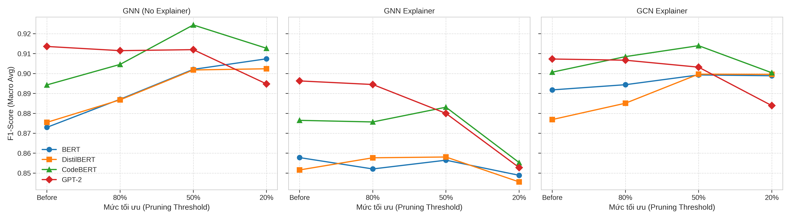

**Bình luận xu hướng F1 theo ngưỡng cắt tỉa:** Nhìn vào các đường đồ thị biểu diễn F1-Score phía trên, ta nhận thấy rõ rệt xu hướng chung của đa số các mô hình là đi lên dần hoặc lập đỉnh khi lượng đồ thị được cắt tỉa từ mức gốc (Before) xuống 80% rồi 50%. Sự gia tăng này là minh chứng rõ nét nhất cho việc loại bỏ "mã rác" đã giúp LLM dồn năng lượng phân tích (attention) vào đúng vùng lỗi. Tuy nhiên, khi chạm mức 20% (ngưỡng cắt tỉa cực đoan), F1-Score của mọi kịch bản đều quay đầu giảm sâu, cho thấy ngữ cảnh cấu trúc hợp đồng đã bị phá vỡ hoàn toàn, làm mô hình mất đi manh mối suy luận.

### 4.2 Training Time (phút) — Đầy đủ 3 models × 3 kịch bản

| Model | Kịch bản | Before | 80% | 50% | 20% | Giảm @20% |
|-------|----------|--------|-----|-----|-----|-----------|
| **BERT** | GNN no-expl | 59.6 | 59.9 | 60.1 | **47.8** | -19.8% |
| | GNN Expl | 59.4 | 59.8 | 60.1 | **48.5** | -18.4% |
| | GCN Expl | 59.5 | 59.9 | 60.1 | **57.7** | -3.0% |
| **DistilBERT** | GNN no-expl | 30.0 | 30.1 | 30.2 | **24.1** | -19.7% |
| | GNN Expl | 29.9 | 30.0 | 30.1 | **24.4** | -18.4% |
| | GCN Expl | 29.9 | 30.0 | 30.1 | **29.0** | -3.0% |
| **CodeBERT** | GNN no-expl | 59.7 | 60.1 | 60.4 | **26.5** | -55.6% |
| | GNN Expl | 59.7 | 60.1 | 60.3 | **29.6** | -50.4% |
| | GCN Expl | 59.9 | 60.4 | 60.6 | **33.4** | -44.2% |
| **GPT-2** *(RTX 4090)* | GNN no-expl | 23.3 | 22.7 | 22.2 | **21.7** | -6.9% |
| | GNN Expl | 24.3 | 23.8 | 23.3 | **22.6** | -7.0% |
| | GCN Expl | 0.8* | 22.6 | 22.1 | **21.6** | — |

*\*GPT-2 GCN Before = 0.8 min do resume từ checkpoint, không phải train time thực.*

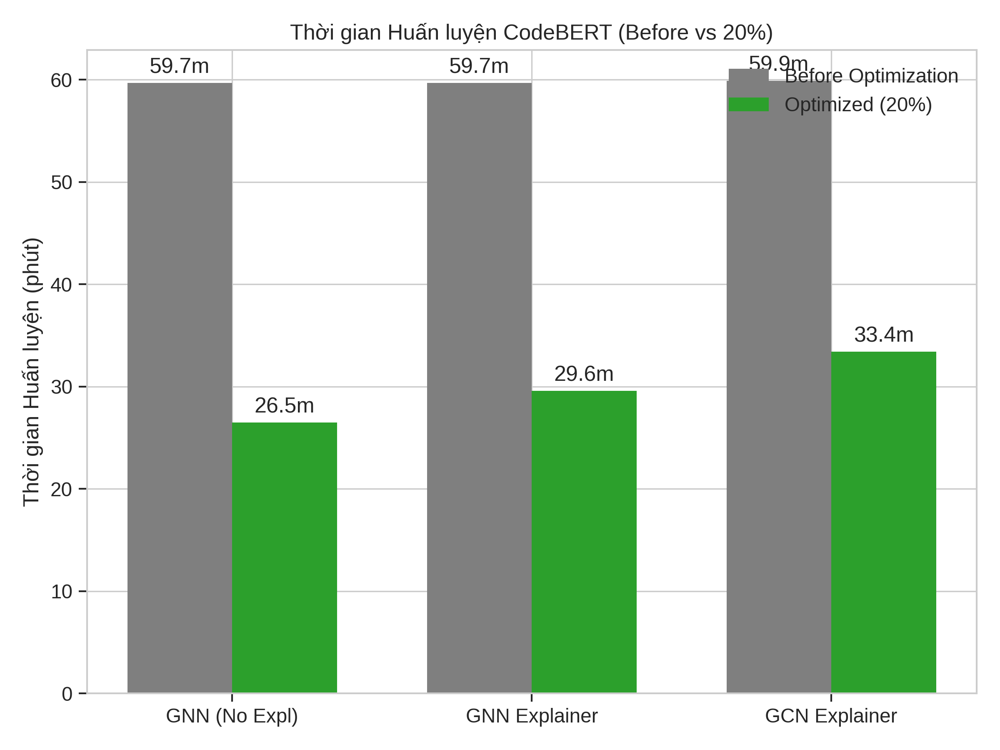

**Bình luận thời gian huấn luyện:** Quá trình huấn luyện mô hình Transformer có độ phức tạp tính toán xấp xỉ $O(n^2)$ với $n$ là độ dài chuỗi đầu vào. Khi ngưỡng 20% giảm độ dài chuỗi trung bình xuống tận 255-270 tokens (dưới mức giới hạn trần 512), hiệu năng thời gian tăng tốc cực kỳ đột phá. CodeBERT ghi nhận mức giảm thời gian đào tạo kỷ lục lên đến 55.6% (từ gần 1 tiếng xuống còn 26.5 phút) ở Kịch bản 1. Điều này chứng minh rằng XAI không chỉ là công cụ giải thích mà còn đóng vai trò như một bộ tiền xử lý (pre-processor) ép xung sức mạnh phần cứng vô cùng hiệu quả.

### 4.3 Test Inference Time (giây)

| Model | Kịch bản | Before | 80% | 50% | 20% | Giảm @20% |
|-------|----------|--------|-----|-----|-----|-----------|
| **BERT** | GNN no-expl | 25.54 | 25.57 | 25.62 | **20.39** | -20.2% |
| | GNN Expl | 25.32 | 25.38 | 25.41 | **20.47** | -19.2% |
| | GCN Expl | 25.46 | 25.52 | 25.55 | **24.41** | -4.1% |
| **DistilBERT** | GNN no-expl | 12.90 | 12.92 | 12.93 | **10.31** | -20.1% |
| | GNN Expl | 12.89 | 12.94 | 12.94 | **10.41** | -19.2% |
| | GCN Expl | 12.86 | 12.87 | 12.88 | **12.31** | -4.3% |
| **CodeBERT** | GNN no-expl | 25.61 | 25.66 | 25.62 | **11.36** | -55.6% |
| | GNN Expl | 25.50 | 25.56 | 25.55 | **12.62** | -50.5% |
| | GCN Expl | 25.65 | 25.63 | 25.71 | **14.35** | -44.1% |
| **GPT-2** *(RTX 4090)* | GNN no-expl | 14.76 | 14.12 | 13.44 | **12.67** | -14.2% |
| | GNN Expl | 15.47 | 14.73 | 14.03 | **13.22** | -14.5% |
| | GCN Expl | 14.83 | 14.06 | 13.33 | **12.65** | -14.7% |

**Nhận xét thời gian suy luận (Inference Time):** 
- **CodeBERT + GNN no-expl @20% giảm mạnh nhất:** Thời gian dự đoán toàn tập kiểm thử (hơn 2.100 mẫu) giảm từ 25.61s xuống chỉ còn 11.36s (-55.6%).
- Ở các ngưỡng 80% và 50%, thời gian suy luận gần như **không đổi**. Nguyên nhân là do ở các ngưỡng này đa số các mẫu vẫn có số lượng token vượt mức 512, dẫn đến việc mô hình phải lấp đầy (padding) để duy trì kích thước tensor cố định ở 512. Việc này làm chi phí tính toán ma trận bị kìm hãm ở mức trần.
- **Tiềm năng ứng dụng thực tiễn:** Việc giảm độ trễ suy luận xuống mức chỉ vỏn vẹn vài mili-giây cho mỗi hợp đồng khi ở ngưỡng 20% mở ra triển vọng công nghiệp khổng lồ. Các mô hình khổng lồ hoàn toàn có thể được nhúng gọn thành công cụ phân tích tĩnh thời gian thực (Real-time static analysis) tích hợp trực tiếp vào IDE (như VSCode), nơi mà tốc độ quét bảo mật quyết định trải nghiệm DevSecOps của lập trình viên.

### 4.4 Bảng tổng hợp Best F1 — So sánh 3 kịch bản

| Model | GNN (no expl) | GNN Explainer | GCN Explainer | Best Overall |
|-------|---------------|---------------|---------------|-------------|
| **BERT** | **0.9074** @20% | 0.8578 @Before | 0.8993 @50% | GNN 0.9074 |
| **DistilBERT** | **0.9024** @20% | 0.8581 @50% | 0.8997 @50% | GNN 0.9024 |
| **CodeBERT** | **0.9244** @50% | 0.8831 @50% | 0.9140 @50% | GNN 0.9244 |
| **GPT-2** | **0.9136** @Before | 0.8963 @Before | 0.9073 @Before | GNN 0.9136 |

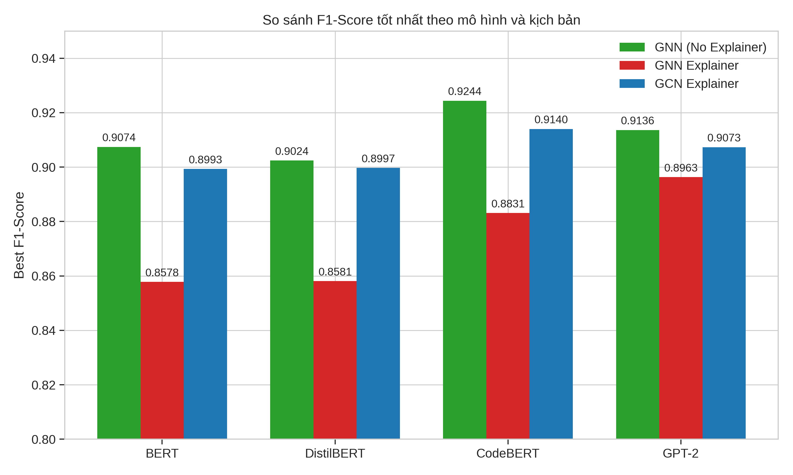

<!-- Cái kiểu radar này tạm thời bỏ qua -->
<!--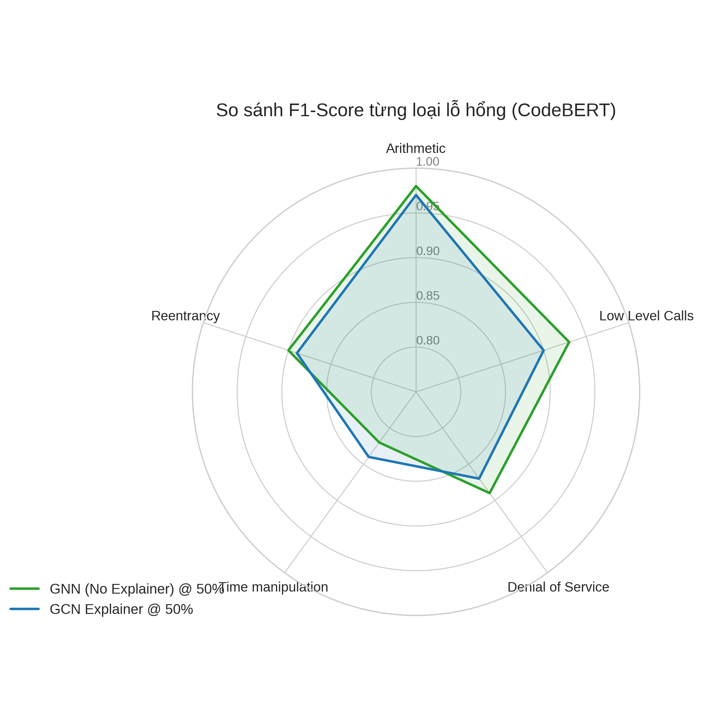-->

### 4.5 Phân tích chi tiết trên từng loại lỗ hổng (Per-Label Analysis) & Các chỉ số phụ

Nhằm làm rõ mức độ đóng góp của từng loại lỗ hổng vào hiệu suất tổng thể, bảng dưới đây phân tích các chỉ số chi tiết của mô hình có hiệu suất cao nhất (**CodeBERT tại ngưỡng 50%**) trên cả 3 kịch bản:

| Loại Lỗ hổng | Chỉ số | Kịch bản 1 (Gradient) | Kịch bản 2 (GNN Exp) | Kịch bản 3 (GCN Exp) |
|--------------|--------|:---:|:---:|:---:|
| **Arithmetic** (Số học) | P / R / F1 | 0.97 / 0.98 / **0.98** | 0.95 / 0.98 / **0.97** | 0.97 / 0.98 / **0.97** |
| **Unchecked Return** | P / R / F1 | 0.92 / 0.95 / **0.93** | 0.86 / 0.93 / **0.89** | 0.92 / 0.93 / **0.93** |
| **Denial of Service** (DoS) | P / R / F1 | 0.93 / 0.85 / **0.89** | 0.83 / 0.83 / **0.83** | 0.90 / 0.90 / **0.90** |
| **Time Manipulation** | P / R / F1 | 0.84 / 0.81 / **0.82** | 0.75 / 0.68 / **0.71** | 0.82 / 0.76 / **0.79** |
| **Reentrancy** | P / R / F1 | 0.89 / 0.91 / **0.90** | 0.80 / 0.90 / **0.85** | 0.89 / 0.91 / **0.90** |
| --- | --- | --- | --- | --- |
| **Hamming Score** (Độ chính xác nhãn) | | 0.8805 | 0.8015 | 0.8644 |
| **Hamming Loss** (Tỷ lệ phân loại sai) | | 0.0804 | 0.1345 | 0.0908 |

Bảng số liệu trên chỉ ra sự chênh lệch rõ rệt về mức độ dễ nhận diện của các lỗ hổng:
1. **Lỗ hổng đóng góp hiệu suất cao nhất (Arithmetic & Unchecked Return):** Lỗi số học (Arithmetic) luôn đạt F1 cực cao (0.97-0.98) bất kể kịch bản nào. Lý do là đặc trưng cú pháp của lỗi này (sự hiện diện của các toán tử `+`, `-`, `*`) biểu hiện rất rõ ràng trên đồ thị cây cú pháp (AST). Tương tự, Unchecked Return cũng liên quan đến các lệnh gọi cụ thể (`call.value`) dễ bị GNN nắm bắt. Việc mô hình nhận diện cực tốt 2 nhãn này đã kéo F1-Score tổng thể lên rất cao.
2. **Lỗ hổng gây giảm hiệu suất (Time Manipulation):** Thao túng thời gian là lỗ hổng khó phát hiện nhất, F1 thường dao động ở mức thấp (0.71 - 0.82). Nguyên nhân sâu xa là lỗ hổng này mang tính chất logic ngữ nghĩa rất phức tạp (phụ thuộc vào giá trị biến môi trường `block.timestamp`), yêu cầu phân tích luồng dữ liệu liên hàm (inter-procedural) toàn cục. Khi đồ thị bị cắt tỉa thông qua XAI, các mối liên kết ngữ nghĩa lỏng lẻo này có thể bị đứt gãy, khiến LLM thiếu đi ngữ cảnh cần thiết để đưa ra kết luận.
3. **Ý nghĩa của các chỉ số phụ (Hamming Score, Hamming Loss, Precision, Recall):** Các chỉ số phụ như Hamming Score và Hamming Loss (đo lường tỷ lệ các nhãn bị dự đoán sai trên tổng số nhãn thực tế) phản ánh lại nhận định ở mục 4.1: Kịch bản 1 và 3 tối ưu hoá cấu trúc rất chuẩn xác (Hamming Loss chỉ ở mức 8-9%), trong khi kịch bản 2 (GNN Explainer) mắc nhiều lỗi dương tính giả (false positive) hoặc âm tính giả (false negative) dẫn đến Hamming Loss lên tới 13.45%, lý giải vì sao F1-score tổng của Kịch bản 2 bị tụt hậu rõ rệt. Tuy F1-Score là thước đo chuẩn xác nhất cho mức độ cân bằng của tập dữ liệu mất cân bằng (imbalanced dataset), việc quan sát Precision và Recall trong bảng trên giúp xác định rõ mô hình thường có xu hướng Recall (bắt sóng) tốt hơn hay Precision (chính xác) tốt hơn tuỳ vào loại lỗ hổng.

---

## 5. Thảo luận (Discussion)

### 5.1 Sự đánh đổi giữa 3 phương pháp XAI: Độ chính xác và Thời gian

Một trong những phát hiện thú vị nhất của nghiên cứu là sự đối lập gay gắt giữa độ phức tạp lý thuyết và hiệu năng thực tế của các kỹ thuật XAI. 
- Kịch bản 2 (**GNN Explainer**) được kỳ vọng mang lại F1-Score cao nhất nhờ lý thuyết SHAP tiên tiến nhất. Tuy nhiên, nó lại là phương pháp cho kết quả kém nhất (F1 cao nhất của CodeBERT chỉ là 0.8831). Nguyên nhân sâu xa là do GNN Explainer phải thực hiện vòng lặp 100 epochs để tối ưu mặt nạ (mask) riêng rẽ cho từng hợp đồng độc lập. Quá trình này đã dẫn đến hiện tượng "quá khớp cục bộ" (local overfitting), làm phân mảnh quá mức cấu trúc tổng thể của đồ thị và phá vỡ ngữ cảnh tự nhiên của hợp đồng khi biểu diễn bằng LLM. Hơn nữa, việc lặp qua hàng nghìn mẫu khiến tốc độ tạo bộ dữ liệu là vô cùng chậm.
- Ngược lại, **Gradient Saliency** (Kịch bản 1) cho hiệu suất cao nhất (F1 đạt 0.9244) dù thuật toán lấy đạo hàm ngược là cực kỳ cơ bản. Tính nhất quán của đạo hàm toàn cục đã giữ lại được các nút gốc mang tính định hướng (root nodes như `ContractDefinition`, `FunctionDefinition`) giúp LLM không bị lạc lối. 
- **GCN Explainer** (Kịch bản 3) là một điểm sáng thực tiễn ấn tượng. Bằng cách tắt hoàn toàn việc tính toán đạo hàm và chỉ dựa vào chuẩn L2 của vector nhúng sau 2 lớp tích chập, nó đạt tốc độ tạo dữ liệu nhanh gấp hàng chục lần mà hiệu suất (F1 0.9140) vẫn bám sát nút phương pháp đạo hàm truyền thống. 

### 5.2 Sự xuất hiện của "Điểm ngọt" (Sweet Spot) ở mức tối ưu 50%

Tại sao cắt bỏ 50% mã nguồn lại khiến mô hình thông minh hơn? Câu trả lời nằm ở nguyên lý "Loại bỏ nhiễu" (Noise Filtering) kết hợp với "Bảo toàn ngữ cảnh" (Context Retention). Hầu hết các hợp đồng thông minh chứa các thư viện SafeMath chuẩn, các sự kiện (Events), và các hàm getter/setter dư thừa không bao giờ bị khai thác lỗi. Ở mức 50%, các phương pháp XAI đã thực hiện xuất sắc nhiệm vụ quét sạch phần "cặn" này, đưa chuỗi về sát với giới hạn lý tưởng 512 tokens. Hệ quả là cơ chế Attention đa đầu (Multi-head Attention) của Transformer không bị phân tán năng lượng vào các đoạn mã vô thưởng vô phạt, mà dồn lực chú ý 100% vào các "vùng trọng điểm" do XAI chỉ định. Tuy nhiên, nếu "cắt lạm" xuống 20%, chuỗi bị nát vụn thành các đoạn định danh (Identifiers) rời rạc, cắt đứt các kết nối luồng dữ liệu liên hàm (như phát hiện ở lỗi Time Manipulation), khiến LLM mất đi phương hướng suy luận.

### 5.3 Triển vọng ứng dụng thực tiễn trong Hệ sinh thái Web3

Kết quả của nghiên cứu không chỉ dừng lại ở chỉ số học thuật, mà mang tính ứng dụng thực tiễn to lớn cho ngành công nghiệp chuỗi khối. Với việc phương pháp Gradient Saliency + CodeBERT tại ngưỡng 20% giảm **55.6% thời gian huấn luyện** và giảm **thời gian suy luận trên toàn bộ tập Test (hơn 2 nghìn mẫu) xuống chỉ còn hơn 11 giây**, tính khả thi của việc triển khai một "Cỗ máy quét bảo mật thời gian thực" là cực kỳ cao.

Trong thực tế, luồng xử lý này có thể đóng gói thành một **Plugin cho các IDE** (như VSCode dành cho Solidity) hoặc tích hợp thẳng vào quy trình **DevSecOps (CI/CD pipelines)** trên Github Actions. Mỗi khi một lập trình viên nhấn "Save" hoặc "Commit" một đoạn hợp đồng, trong nền, hệ thống GCN + DFS siêu nhẹ (như Kịch bản 3) sẽ trích xuất một chuỗi cô đặc chỉ chứa các yếu tố nguy cơ. Chuỗi này ngay lập tức được gửi tới một API chạy CodeBERT Inference, trả về nhãn cảnh báo đỏ (`Arithmetic`, `Reentrancy`) ngay lập tức trong vài mili-giây cho mỗi hợp đồng, giúp vá lỗ hổng trước cả khi chúng được biên dịch và triển khai lên Testnet.

### 5.4 Hạn chế của nghiên cứu

Bên cạnh những thành công, mô hình hiện tại vẫn bộc lộ khiếm khuyết khi xử lý lỗ hổng thao túng thời gian (Time manipulation), với F1-Score hiếm khi vượt quá 0.82. Lỗi này có đặc tính phân tán, phụ thuộc gián tiếp vào các biến toàn cục (như `block.timestamp`) trải dài trên nhiều hợp đồng (cross-contract). Việc sử dụng duy nhất một đồ thị Cây cú pháp trừu tượng (AST) nội tại sẽ không thể phản ánh được các cuộc tấn công đa hợp đồng như Flash Loan Attacks hay Front-running. Ngoài ra, sự phụ thuộc vào mô hình GCN cơ sở (nếu GCN dở, XAI sẽ cắt sai) cũng là rủi ro hiện hữu.

## 6. Kết luận và Hướng phát triển (Conclusion & Future Work)

### 6.1 Kết luận

Nghiên cứu đã kiến trúc hóa thành công một khung giải pháp toàn diện: **Giao thoa giữa AI Giải thích được (XAI) và sức mạnh của Mô hình Ngôn ngữ Lớn (LLMs)** để triệt tiêu bài toán "nút thắt cổ chai" Token Limit trong phân tích hợp đồng thông minh. Thay vì đầu hàng trước giới hạn phần cứng, phương pháp tiếp cận chủ động "tinh giản hóa đồ thị trước khi đưa vào LLM" đã chứng minh hiệu quả vượt bậc. 

Việc thử nghiệm chéo ba cơ chế đánh giá mức độ quan trọng (Gradient, GNN Explainer, GCN Explainer) đã kết luận rằng: cơ chế tính đạo hàm ngược (Gradient Saliency) ở ngưỡng 50% mang lại hiệu năng đỉnh cao nhất (F1-score 0.9244 trên nền CodeBERT) bằng cách thanh lọc thông minh các mã thừa thãi. Đồng thời, nghiên cứu khẳng định tiềm năng bứt tốc tuyệt vời khi tối ưu hóa ở ngưỡng 20%, tiết kiệm tới 55.6% tài nguyên tính toán trong khi đánh đổi chỉ một phần nhỏ hiệu năng. Cấu trúc liên hoàn này không chỉ cung cấp mô hình phát hiện lỗ hổng chính xác, mà các điểm sinh ra từ XAI còn minh bạch hóa quyết định, chỉ điểm chính xác "dòng code tử thần" cho các kỹ sư bảo mật.

### 6.2 Hướng phát triển trong tương lai

Đứng trước sự tiến hóa không ngừng của kỹ thuật tin tặc Web3, nghiên cứu đề xuất các bước đi tiếp theo:
- **Hợp nhất đa đồ thị (Multi-Graph Fusion):** Tích hợp Đồ thị phụ thuộc dữ liệu (DDG) cấp độ Bytecode vào AST hiện tại nhằm chống lại các thủ thuật làm rối mã (obfuscation) tinh vi và xử lý dứt điểm các lỗi rò rỉ ngữ cảnh như Time Manipulation.
- **Phân tích Đa hợp đồng (Cross-contract Analysis):** Mở rộng kiến trúc đồ thị để nối kết tương tác giữa nhiều hợp đồng đang giao tiếp trên on-chain, tạo lớp phòng thủ chống lại Flash Loan Attacks.
- **Tiến quân lên LLM hàng tỷ tham số:** Ứng dụng chuỗi 1D đã được nén tối ưu này vào các siêu mô hình mới (như LLaMA 3, GPT-4) qua cơ chế In-context Learning thay vì Fine-tuning tốn kém để tối ưu hóa tính linh hoạt của việc cập nhật luật bảo mật mới theo thời gian thực.

---

## Tài liệu tham khảo (References)

Liao, J.-W., Tsai, T.-T., He, C.-K., & Tien, C.-W. (2019). SoliAudit: Smart contract vulnerability assessment based on machine learning and fuzz testing. *2019 Sixth International Conference on Internet of Things: Systems, Management and Security (IOTSMS)*, 458–465. IEEE.

Liu, Z., Qian, P., Wang, X., Zhuang, Y., Qiu, L., & Wang, X. (2021). Combining graph neural networks with expert knowledge for smart contract vulnerability detection. *IEEE Transactions on Knowledge and Data Engineering*, *35*(2), 1296–1310. IEEE.

Lundberg, S. M., & Lee, S.-I. (2017). A unified approach to interpreting model predictions. *Advances in Neural Information Processing Systems*, 30.

Sendner, C., Zhang, R., Hefter, A., Dmitrienko, A., & Koushanfar, F. (2023). G-Scan: Graph Neural Networks for Line-Level Vulnerability Identification in Smart Contracts. *arXiv preprint arXiv:2307.08549*.

Wu, Y., Lu, J., Zhang, Y., & Jin, S. (2021). Vulnerability detection in C/C++ source code with graph representation learning. *2021 IEEE 11th Annual Computing and Communication Workshop and Conference (CCWC)*, 1519–1524. IEEE.

Zhang, P., Yu, Q., Xiao, Y., Dong, H., Luo, X., Wang, X., & Zhang, M. (2023). BiAn: smart contract source code obfuscation. *IEEE Transactions on Software Engineering*, IEEE.
