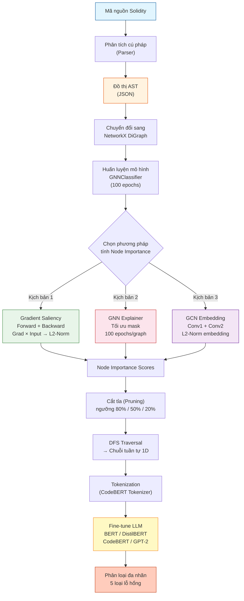
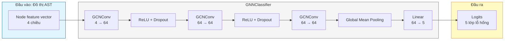
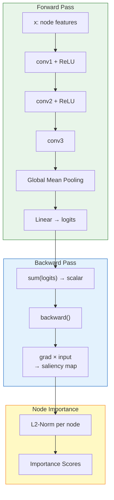
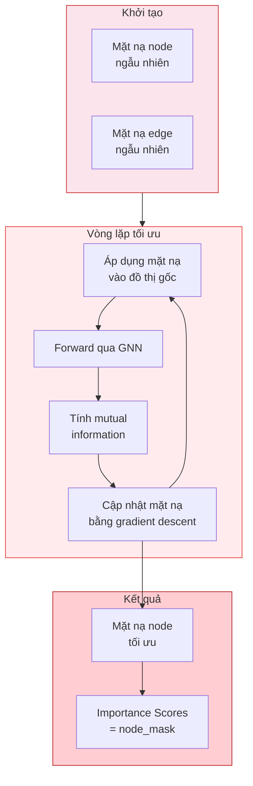
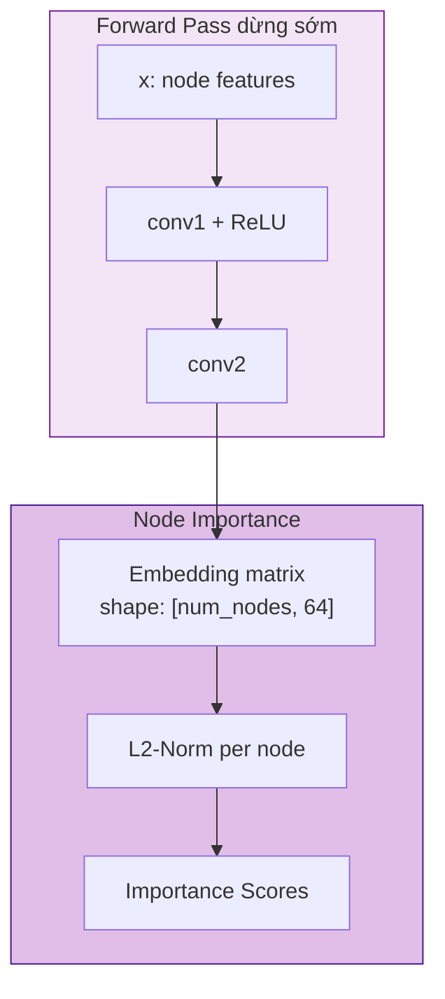
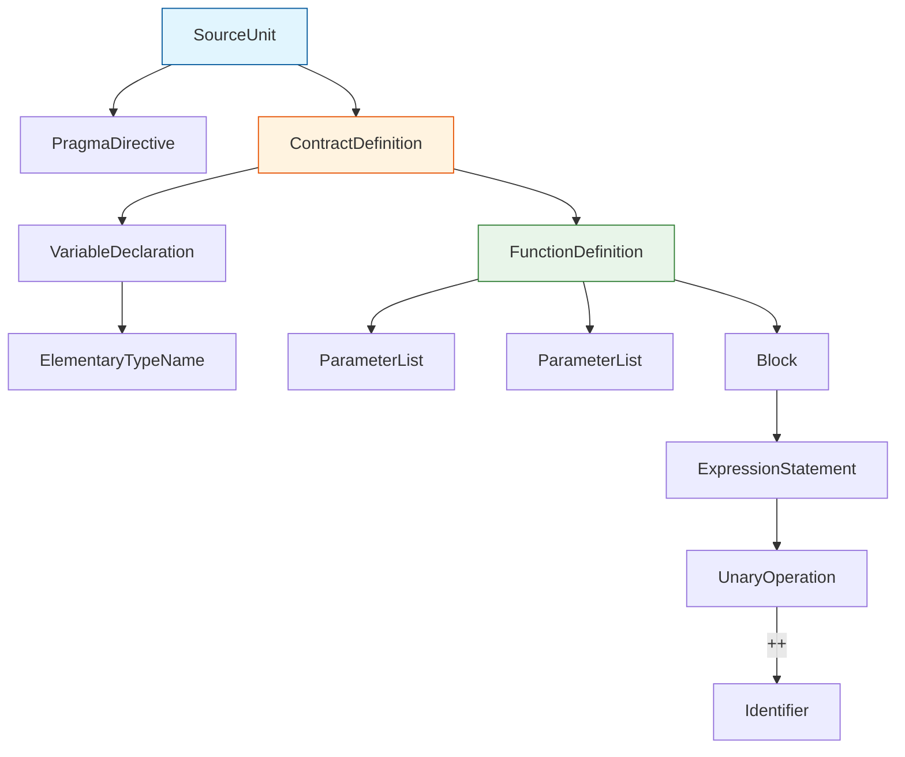

## Thông tin kết quả nghiên cứu

**1. Thông tin chung**

- **Tên đề tài:** MỘT HƯỚNG TIẾP CẬN TINH CHỈNH MÔ HÌNH NGÔN NGỮ LỚN VÀ TỐI ƯU CHUỖI TỪ ĐỒ THỊ CÂY CÚ PHÁP TRỪU TƯỢNG TRONG PHÁT HIỆN LỖ HỔNG HỢP ĐỒNG THÔNG MINH
- **Tên tiếng Anh:** A NOVEL APPROACH TO FINE-TUNING LARGE LANGUAGE MODELS AND OPTIMIZING ABSTRACT SYNTAX TREE SEQUENCES FOR SMART CONTRACT VULNERABILITY DETECTION
- **Cơ quan chủ trì:** Trường Đại học Công nghệ Thông tin, ĐHQG TP. HCM
- **Thời gian thực hiện:** 6 tháng
- **Lĩnh vực:** An toàn thông tin mạng, Trí tuệ nhân tạo, Blockchain

**2. Mục tiêu**

Nghiên cứu hướng đến ba mục tiêu cốt lõi: (1) xây dựng pipeline chuyển đổi Solidity → AST → XAI → chuỗi tuần tự nhằm giải quyết bài toán giới hạn token đầu vào của các mô hình ngôn ngữ lớn; (2) triển khai và so sánh ba kỹ thuật XAI khác nhau (Gradient Saliency, GNN Explainer, GCN Explainer) trên cùng một kiến trúc GNN thống nhất; (3) phân tích tác động của luồng xử lý đề xuất trên bốn kiến trúc LLM (BERT, DistilBERT, CodeBERT, GPT-2) đối với bài toán phân loại đa nhãn năm loại lỗ hổng bảo mật.

**3. Tính mới và sáng tạo**

Giải pháp đề xuất giải quyết triệt để bài toán Token Limit thông qua cơ chế "lọc thông minh" dựa trên XAI, cho phép cắt tỉa đồ thị AST một cách có chủ đích thay vì cắt ngẫu nhiên như các phương pháp truyền thống. Nghiên cứu tiến hành so sánh đối chiếu ba phương pháp XAI trên cùng một kiến trúc GNN, phát hiện điểm tối ưu ở ngưỡng giữ lại 50% số nút, đồng thời ghi nhận mức tiết kiệm tài nguyên tính toán lên đến 55,6% ở ngưỡng 20% mà vẫn duy trì hiệu năng chấp nhận được.

**4. Tóm tắt kết quả nghiên cứu**

Nghiên cứu đã huấn luyện và đánh giá 12 mô hình LLM (BERT, DistilBERT, CodeBERT, GPT-2 × 3 kịch bản XAI) trên tập dữ liệu SoliAudit gồm 10.555 mẫu hợp đồng thông minh đã được xử lý thành đồ thị AST. Kết quả thực nghiệm ghi nhận chỉ số F1-Score cao nhất đạt 0,9244 từ mô hình CodeBERT kết hợp với phương pháp Gradient Saliency tại ngưỡng giữ lại 50% số nút. Đáng chú ý, ở ngưỡng tối ưu hóa 20%, phương pháp này giúp giảm 55,6% thời gian huấn luyện và suy luận, giảm số lượng token trung bình từ ~1.294 xuống ~255, đồng thời vẫn duy trì F1-score trên mức 0,90.

**5. Tên sản phẩm**

- Bộ dữ liệu SoliAudit đã qua tối ưu hóa XAI với ba kịch bản × ba ngưỡng cắt tỉa
- Pipeline phát hiện lỗ hổng hợp đồng thông minh hoàn chỉnh
- 12 mô hình LLM đã được huấn luyện và đánh giá
- Bộ công cụ đánh giá và so sánh hiệu năng
- Báo cáo kết quả thực nghiệm chi tiết

**6. Hiệu quả, phương thức chuyển giao và khả năng áp dụng**

Pipeline đề xuất giải quyết triệt để bài toán giới hạn token đầu vào của LLM thông qua cơ chế lọc thông minh dựa trên XAI. Giải pháp có thể được tích hợp vào môi trường IDE, CI/CD pipeline hoặc plugin DevSecOps dưới dạng mã nguồn mở trên GitHub, mở ra hướng tiếp cận mới cho việc phát triển các công cụ quét mã độc tĩnh thời gian thực (real-time scanner) trong lĩnh vực blockchain.

---

# TÓM TẮT

Sự phát triển mạnh mẽ của công nghệ blockchain đã kéo theo sự bùng nổ của hợp đồng thông minh (smart contract), đóng vai trò quản lý khối lượng tài sản số khổng lồ trên các nền tảng phi tập trung. Đi kèm với đó là rủi ro an ninh mạng gia tăng khi các lỗ hổng mã nguồn có thể dẫn đến thiệt hại kinh tế nghiêm trọng, điển hình như vụ tấn công KyberSwap năm 2023 gây thiệt hại 47 triệu USD. Mặc dù các Mô hình ngôn ngữ lớn (Large Language Models — LLMs) cho thấy tiềm năng xuất sắc trong việc phân tích mã nguồn, chúng vấp phải rào cản kỹ thuật lớn: giới hạn nghiêm ngặt về số lượng token đầu vào (ví dụ: 512 tokens đối với kiến trúc họ BERT). Trong khi đó, các hợp đồng thông minh được biểu diễn dưới dạng Đồ thị Cây cú pháp trừu tượng (Abstract Syntax Tree — AST) thường tạo ra những chuỗi đồ thị siêu dài, gây ra hiện tượng cắt xén ngẫu nhiên (truncation) làm mất đi các ngữ cảnh cốt lõi về lỗ hổng.

Nghiên cứu này đề xuất một luồng xử lý (pipeline) mới nhằm giải quyết vấn đề trên bằng cách tích hợp các kỹ thuật Trí tuệ nhân tạo có thể giải thích (Explainable AI — XAI) để tối ưu hóa đồ thị AST trước khi đưa vào LLM. Thay vì chỉ dựa vào một kỹ thuật duy nhất, nghiên cứu tiến hành đánh giá và đối chiếu ba kịch bản trích xuất đặc trưng đồ thị khác nhau: (1) tính toán đạo hàm ngược từ đầu ra mô hình GNN về không gian đặc trưng đầu vào; (2) GNN Explainer — tối ưu hóa mặt nạ đồ thị con thông qua vòng lặp lặp lại; và (3) GCN Embedding L2-Norm — đánh giá mức độ quan trọng dựa trên chuẩn L2 của vector nhúng sau hai lớp tích chập đồ thị. Các thuật toán này chấm điểm mức độ quan trọng (importance scores) cho từng nút trong đồ thị AST, sau đó tiến hành cắt tỉa (pruning) ở các ngưỡng 80%, 50% và 20%. Đồ thị sau khi được cô đặc sẽ trải qua thuật toán duyệt theo chiều sâu (Depth-First Search — DFS) để chuyển đổi thành chuỗi tuần tự một chiều (1D sequence), trước khi được tinh chỉnh (fine-tuning) qua bốn kiến trúc LLM (BERT, CodeBERT, DistilBERT, GPT-2) cho bài toán phân loại đa nhãn năm loại lỗ hổng phổ biến từ tập dữ liệu SoliAudit (10.555 mẫu).

Kết quả thực nghiệm chỉ ra rằng việc cắt tỉa đồ thị không chỉ loại bỏ nhiễu thành công mà còn cải thiện hiệu năng vượt bậc. Cụ thể, mô hình CodeBERT kết hợp với Gradient Saliency tại ngưỡng giữ lại 50% đạt chỉ số F1-Score cao nhất là 0,9244. Đáng chú ý hơn, ở ngưỡng tối ưu hóa 20%, phương pháp này giúp thời gian huấn luyện và suy luận giảm tới 55,6% (từ 59,7 phút xuống còn 26,5 phút đối với CodeBERT), giảm số lượng token trung bình từ ~1.294 xuống ~255, mà vẫn duy trì F1-score trên mức 0,90. Nghiên cứu đóng góp một khung giải pháp toàn diện, kết hợp ưu điểm của biểu diễn đồ thị, khả năng giải thích của XAI và sức mạnh phân tích ngữ nghĩa của LLM, mở ra hướng đi mới trong việc phát triển các công cụ quét mã độc tĩnh thời gian thực cho các dự án Web3.

---

# MỞ ĐẦU

## Đặt vấn đề

Công nghệ Blockchain đang chứng kiến sự phát triển liên tục và thu hút sự quan tâm đáng kể từ cả giới học thuật và thương mại. Hệ thống blockchain sở hữu những đặc tính ưu việt mang tính cách mạng như tính phân tán, tính bất biến và tính minh bạch. Những đặc điểm này không chỉ giới hạn trong lĩnh vực tiền mã hóa mà còn được triển khai rộng rãi trong chăm sóc sức khỏe, tài chính kỹ thuật số (DeFi), và quản lý chuỗi cung ứng. Nổi bật nhất trong số các nền tảng blockchain là Ethereum, nền tảng tiên phong đưa khái niệm hợp đồng thông minh (smart contract) vào thực tiễn. Hợp đồng thông minh là các đoạn mã tự thực thi được triển khai trên nền tảng blockchain, đóng vai trò kiểm soát một lượng lớn tiền tệ và các giao dịch tài chính tự động.

Cùng với sự mở rộng của hệ sinh thái Web3, các hợp đồng thông minh ngày càng trở nên phức tạp, tích hợp nhiều tính năng và tương tác đa dạng với các giao thức khác nhau. Tuy nhiên, chính sự phức tạp này đã tạo ra một bề mặt tấn công rộng lớn, dẫn đến sự xuất hiện của nhiều lỗ hổng bảo mật ẩn sâu trong mã nguồn, rất khó phát hiện bằng mắt thường nhưng lại cực kỳ dễ bị khai thác bởi những tác nhân độc hại. Một ví dụ điển hình gây chấn động cộng đồng là vụ tấn công KyberSwap — một nền tảng giao dịch phi tập trung của Việt Nam — vào năm 2023. Trong sự cố này, tin tặc đã khéo léo khai thác các lỗ hổng liên quan đến reentrancy và tính toán thanh khoản để đánh cắp khối lượng tài sản ước tính lên tới 47 triệu USD. Kẻ tấn công ngày nay không ngừng nâng cấp các kỹ thuật tiên tiến, bao gồm làm rối mã (obfuscation) hay chèn mã (code injection) để vượt qua các cơ chế kiểm tra bảo mật thông thường. Những sự cố này không chỉ gây ra tổn thất kinh tế nặng nề mà còn làm xói mòn niềm tin của người dùng vào tính an toàn của hệ thống blockchain. Do đó, việc nghiên cứu và phát triển các phương pháp nhận diện lỗ hổng tự động, chính xác và hiệu quả cho hợp đồng thông minh đang trở thành một trong những ưu tiên hàng đầu của lĩnh vực an toàn thông tin mạng.

## Động lực nghiên cứu

Trước thực trạng an ninh mạng đáng báo động trong không gian blockchain, nhiều phương pháp tiếp cận đã được đề xuất nhằm nhận diện sớm các lỗ hổng. Các phương pháp truyền thống như phân tích tĩnh (static analysis) hay thực thi tự động (symbolic execution) mặc dù phổ biến nhưng thường gặp hạn chế về tỷ lệ dương tính giả (false positive) cao và không thể nắm bắt được những ngữ nghĩa phức tạp trong mã. Gần đây, việc áp dụng các mô hình học sâu, đặc biệt là Mạng nơ-ron đồ thị (Graph Neural Network — GNN) đã mang lại những bước tiến đáng kể. Bằng cách biểu diễn hợp đồng thông minh dưới dạng Đồ thị Cây cú pháp trừu tượng (Abstract Syntax Tree — AST), GNN có thể khai thác được các mối quan hệ cấu trúc giữa các khối mã.

Tuy nhiên, hiệu quả của các mô hình GNN phụ thuộc rất lớn vào chất lượng của biểu diễn đồ thị và đòi hỏi kiến thức chuyên môn sâu để tinh chỉnh. Sự xuất hiện của Mô hình ngôn ngữ lớn (Large Language Models — LLMs) như BERT, CodeBERT hay GPT đã cung cấp một hướng tiếp cận thay thế mạnh mẽ nhờ khả năng thấu hiểu ngữ cảnh và ngữ nghĩa sâu sắc của văn bản mã nguồn. Dù vậy, khi áp dụng LLM vào hợp đồng thông minh, một rào cản kỹ thuật nghiêm trọng xuất hiện: giới hạn về độ dài chuỗi đầu vào. Phần lớn các mô hình dựa trên kiến trúc Transformer (như BERT) chỉ cho phép độ dài tối đa là 512 tokens. Trong khi đó, thống kê thực tế cho thấy các đồ thị AST của hợp đồng thông minh trung bình chứa tới hơn 835 nút, tương đương với hàng nghìn tokens khi chuyển đổi thành chuỗi. Việc cắt cụt (truncate) chuỗi mã để vừa với giới hạn 512 tokens chắc chắn sẽ dẫn đến việc loại bỏ nhiều đoạn mã quan trọng, bao gồm cả những vị trí chứa lỗ hổng cốt lõi, làm suy giảm nghiêm trọng khả năng phát hiện của mô hình.

Động lực chính của nghiên cứu này xuất phát từ nhu cầu giải quyết mâu thuẫn giữa kích thước khổng lồ của biểu diễn mã nguồn và giới hạn tài nguyên của các mô hình ngôn ngữ lớn. Thay vì cắt bỏ thông tin một cách ngẫu nhiên hay chỉ lấy phần đầu của mã, nghiên cứu hướng tới việc tạo ra một cơ chế "lọc" thông minh, có khả năng đánh giá mức độ quan trọng của từng phần tử trong mã nguồn, từ đó chỉ giữ lại những thành phần thực sự cần thiết cho việc phân loại lỗ hổng.

## Mục tiêu nghiên cứu

Nghiên cứu này được thực hiện với ba mục tiêu cốt lõi sau:

**Thứ nhất**, xây dựng một luồng xử lý (pipeline) thông minh chuyển đổi mã nguồn Solidity phi cấu trúc thành Đồ thị Cây cú pháp trừu tượng (AST), sau đó biểu diễn lại dưới dạng chuỗi tuần tự tương thích hoàn toàn với đầu vào của các Mô hình ngôn ngữ lớn (LLM).

**Thứ hai**, triển khai và so sánh hiệu năng của ba kỹ thuật Trí tuệ nhân tạo có thể giải thích (Explainable AI — XAI) khác nhau: (1) Tính toán Đạo hàm ngược (Gradient Saliency), (2) Tối ưu hóa mặt nạ đồ thị (GNN Explainer), và (3) Chuẩn L2 của không gian nhúng (GCN Embedding L2-Norm). Việc ứng dụng ba cơ chế này nhằm lượng hoá mức độ quan trọng của các nút trong AST để tiến hành cắt tỉa (pruning) ở ba mức độ: 80%, 50% và 20%.

**Thứ ba**, phân tích đa chiều tác động của luồng xử lý trên bốn kiến trúc LLM đa dạng (BERT, DistilBERT, CodeBERT và GPT-2) dựa trên bài toán phân loại đa nhãn. Mục tiêu hướng tới không chỉ là tối ưu hóa F1-Score mà còn là việc giảm thiểu tối đa chi phí huấn luyện và thời gian suy luận, làm tiền đề cho việc tích hợp vào các công cụ thực tế.

## Phạm vi nghiên cứu

Để đảm bảo tính khả thi và đánh giá chuyên sâu, nghiên cứu được thiết lập với các ranh giới sau:

- **Tập dữ liệu:** Phân tích trực tiếp trên tập dữ liệu SoliAudit chứa 10.555 mẫu hợp đồng thông minh đã được xử lý thành đồ thị AST (JSON). Dữ liệu tập trung giải quyết phân loại năm lỗ hổng nghiêm trọng nhất thuộc chuẩn DASP v2: Lỗi số học (Arithmetic), Không kiểm tra giá trị trả về (Unchecked Return), Tấn công từ chối dịch vụ (DoS), Thao túng thời gian (Time manipulation), và Tấn công chui lại (Reentrancy).

- **Phạm vi mô hình:** Nghiên cứu so sánh chéo bốn biến thể LLM: một mô hình xử lý ngôn ngữ truyền thống (BERT), một phiên bản nén nhẹ (DistilBERT), một mô hình chuyên biệt cho mã nguồn (CodeBERT), và một mô hình sinh tự hồi quy (GPT-2).

- **Phạm vi kỹ thuật XAI:** Nghiên cứu chỉ tập trung khai thác điểm số giải thích (Importance Scores) trên mạng GNN và GCN để trích xuất đặc trưng cấu trúc (Structural Features) ở mức AST, chưa tính tới việc mở rộng cho các luồng dữ liệu cấp độ bytecode.

---

# CÁC CÔNG TRÌNH NGHIÊN CỨU LIÊN QUAN

## Hợp đồng thông minh và Lỗ hổng bảo mật

Hợp đồng thông minh (Smart Contract) là các chương trình máy tính tự động thực thi được lưu trữ trên một mạng lưới blockchain (như Ethereum). Chúng hoạt động dựa trên các điều khoản đã được định nghĩa trước mà không cần thông qua bên thứ ba trung gian. Mặc dù mang lại tính minh bạch và tự động hóa cao, mã nguồn hợp đồng thông minh (thường được viết bằng ngôn ngữ Solidity) chứa đựng nhiều rủi ro bảo mật tiềm ẩn. Vì tính chất bất biến của blockchain, một khi hợp đồng đã được triển khai, mã nguồn không thể bị thay đổi để vá lỗi, khiến mọi lỗ hổng trở thành mục tiêu béo bở cho hacker.

Nghiên cứu này tập trung vào năm loại lỗ hổng phổ biến nhất theo phân loại của chuẩn DASP v2 (Decentralized Application Security Project), một khung phân loại đã được hệ thống hóa bởi Atzei et al. (2017):

1. **Arithmetic (Lỗi số học):** Xảy ra khi các phép toán cộng trừ nhân chia vượt quá giới hạn của kiểu dữ liệu (Overflow/Underflow), dẫn đến kết quả tính toán sai lệch, thường bị lợi dụng để thao túng số dư token.
2. **Unchecked Return Values For Low Level Calls:** Khi một hợp đồng gọi đến hợp đồng khác thông qua các lệnh gọi mức thấp (như `call`, `send`, `delegatecall`) nhưng không kiểm tra giá trị trả về (`true`/`false`). Nếu cuộc gọi thất bại nhưng hợp đồng gốc vẫn tiếp tục thực thi, nó có thể dẫn đến trạng thái không nhất quán.
3. **Denial of Service (DoS):** Tấn công từ chối dịch vụ nhằm mục đích vô hiệu hóa hợp đồng, thường được thực hiện bằng cách làm cạn kiệt lượng Gas cho phép hoặc thao túng các vòng lặp khiến hợp đồng không thể hoàn thành giao dịch.
4. **Time Manipulation (Thao túng thời gian):** Xảy ra khi logic của hợp đồng phụ thuộc vào `block.timestamp`. Kẻ khai thác có khả năng tinh chỉnh nhẹ timestamp của khối, qua đó thao túng các hàm sinh số ngẫu nhiên hoặc các điều kiện thời gian để trục lợi.
5. **Reentrancy (Tấn công chui lại):** Lỗ hổng nguy hiểm nhất, cho phép kẻ tấn công gọi lại chính hàm đang thực thi trước khi trạng thái của hàm đó (như số dư tài khoản) được cập nhật. Kẻ tấn công có thể rút cạn tiền của hợp đồng nạn nhân thông qua một vòng lặp gọi đệ quy liên tục.

## Đồ thị Cây cú pháp trừu tượng (AST)

Để máy tính có thể "hiểu" và phân tích cấu trúc của mã nguồn, các đoạn mã Solidity thường được biên dịch và biểu diễn dưới dạng đồ thị. Một trong những dạng biểu diễn phổ biến nhất là Đồ thị Cây cú pháp trừu tượng (Abstract Syntax Tree — AST). Trong đó, AST là một biểu diễn dạng cây của cấu trúc mã nguồn mức cao, nơi mỗi nút (node) biểu diễn một cấu trúc ngữ pháp như khai báo biến, biểu thức điều kiện, hoặc vòng lặp. Trong nghiên cứu này, mã nguồn hợp đồng thông minh được chuyển đổi thành định dạng AST (dưới dạng file JSON), cung cấp một bức tranh toàn cảnh về mặt cú pháp.

Việc biểu diễn dưới dạng đồ thị giúp giữ lại được các đặc trưng ngữ nghĩa quan trọng mà việc chỉ đọc mã nguồn dưới dạng văn bản thuần túy (plain text) có thể bỏ sót, một hướng tiếp cận đã được chứng minh tính hiệu quả trong nhiều nghiên cứu về phát hiện lỗ hổng và làm rối mã (Wu et al., 2021; Zhang et al., 2023).

## Mô hình ngôn ngữ lớn (LLM) trong phân tích mã nguồn

Sự ra đời của kiến trúc Transformer (Vaswani et al., 2017) đã mở ra kỷ nguyên của các Mô hình ngôn ngữ lớn (LLMs). Các mô hình như BERT (Devlin et al., 2019), CodeBERT (Feng et al., 2020), DistilBERT (Sanh et al., 2019) và GPT-2 (Radford et al., 2019) đều có khả năng chuyển đổi chuỗi mã nguồn thành các vector nhúng (embeddings) mang ngữ nghĩa và khả năng phân loại nhãn sâu sắc. Tuy nhiên, hạn chế lớn nhất của họ mô hình dựa trên Transformer (đặc biệt là BERT) là kích thước cửa sổ ngữ cảnh (context window) bị giới hạn cứng, ví dụ với BERT là 512 tokens và GPT-2 là 1024 tokens. Khoảng 94,1% mẫu trong tập dữ liệu vượt quá giới hạn 512 tokens này trước khi tối ưu, khiến việc cắt cụt ngẫu nhiên làm mất mát thông tin quan trọng.

## Tích hợp XAI trong phân tích Đồ thị mã nguồn

Trí tuệ nhân tạo có thể giải thích (Explainable AI — XAI) là một tập hợp các kỹ thuật thiết yếu nhằm minh bạch hóa quá trình suy luận của các mô hình hộp đen (black-box) phức tạp. Nghiên cứu này kết hợp ba trường phái XAI khác nhau để khai thác thông tin từ Mạng nơ-ron đồ thị:

1. **Đạo hàm ngược:** Kỹ thuật cổ điển dựa trên tính toán đạo hàm ngược từ đầu ra của hàm mất mát (loss) về không gian đặc trưng đầu vào (Simonyan et al., 2014). Điểm số của nút được định lượng bằng chuẩn L2 của tích số đặc trưng và đạo hàm.
2. **GNN Explainer (SHAP):** Phương pháp tiên tiến sử dụng giá trị SHAP dựa trên lý thuyết trò chơi (Lundberg & Lee, 2017), được triển khai theo kiến trúc GNNExplainer của Ying et al. (2019). Thuật toán học cách tạo ra một "mặt nạ đồ thị con" nhằm cực đại hóa lượng thông tin tương hỗ giữa đồ thị ban đầu và đồ thị bị che.
3. **Xếp hạng không gian nhúng:** Kỹ thuật nhẹ dựa trên kiến trúc Graph Convolutional Network (Kipf & Welling, 2017), chỉ truyền thông tin qua hai lớp chập để nắm bắt cấu trúc lân cận 2-hop, các nút có vector nhúng chứa năng lượng lớn nhất (chuẩn L2) được coi là các nút trọng tâm.

## Các nghiên cứu liên quan

Trong bối cảnh phát hiện lỗ hổng hợp đồng thông minh, các phương pháp đã trải qua nhiều giai đoạn: từ phân tích tĩnh (Oyente, Securify, Mythril, Slither) đến Học sâu với GNN (Zhuang et al., 2020; Liu et al., 2021; Sendner et al., 2023) và gần đây là LLM. Các nghiên cứu tiên phong như Zhuang et al. (2020) đã chứng minh rằng GNN có thể khai thác hiệu quả cấu trúc đồ thị của hợp đồng thông minh, trong khi GraphCodeBERT (Guo et al., 2021) mở ra hướng tiếp cận kết hợp biểu diễn mã nguồn với luồng dữ liệu. Nghiên cứu này lấp đầy khoảng trống bằng cách đề xuất cơ chế "giảm chiều dữ liệu có hướng đích" thông qua XAI, kết hợp điểm mạnh của biểu diễn đồ thị, khả năng giải thích của GNN Explainer và sức mạnh phân tích ngữ nghĩa của LLM.

---

# ĐỀ XUẤT GIẢI PHÁP

## Tổng quan luồng xử lý

Hệ thống đề xuất hoạt động dựa trên một luồng xử lý (pipeline) khép kín, được thiết kế để chuyển đổi mã nguồn phi cấu trúc thành dữ liệu tối ưu cho Mô hình ngôn ngữ lớn (LLM). Sơ đồ dưới đây minh họa toàn bộ pipeline từ đầu vào là mã nguồn Solidity đến đầu ra là kết quả phân loại lỗ hổng:



Cụ thể, luồng xử lý bắt đầu bằng việc chuyển đổi mã nguồn Solidity thành Đồ thị Cây cú pháp trừu tượng (AST) dưới dạng JSON, kế thừa tư tưởng từ phương pháp biểu diễn học máy của Wu et al. (2021). Đồ thị này sau đó được nạp vào đối tượng DiGraph của thư viện NetworkX để trích xuất các đặc trưng hình học. Điểm cốt lõi của pipeline nằm ở bước huấn luyện một mô hình Graph Convolutional Network (GCN) (Kipf & Welling, 2017) trong 100 epochs, từ đó ứng dụng ba kỹ thuật XAI để tính toán điểm số quan trọng (Node Importance Scoring) cho từng nút. Các nút không mang thông tin nhạy cảm về lỗ hổng sẽ bị loại bỏ thông qua cơ chế cắt tỉa (Pruning) ở các ngưỡng 80%, 50% hoặc 20%. Cuối cùng, đồ thị đã được cô đặc sẽ trải qua thuật toán duyệt theo chiều sâu (DFS) để chuyển đổi ngược lại thành dạng chuỗi một chiều (1D Sequence) trước khi được tinh chỉnh (fine-tuning) qua các LLMs (BERT, DistilBERT, CodeBERT, GPT-2) cho bài toán phân loại đa nhãn năm loại lỗ hổng.

## Tập dữ liệu

Nghiên cứu này sử dụng tập dữ liệu SoliAudit (đã được dán nhãn theo chuẩn DASP v2 bởi Liao et al., 2019), bao gồm mã nguồn của hàng ngàn hợp đồng thông minh đã được biên dịch thành cấu trúc AST (JSON). Tập dữ liệu được phân chia theo tỷ lệ: tập huấn luyện (gồm 8.444 mẫu) và tập kiểm thử (gồm 2.111 mẫu). Bài toán đặt ra là phân loại đa nhãn (Multi-label classification) cho năm loại lỗ hổng bảo mật cốt lõi.


Biểu đồ trên thể hiện sự phân bổ không đồng đều đặc trưng của dữ liệu bảo mật thực tế: Lỗi số học (Arithmetic) chiếm ưu thế áp đảo với hơn một nửa số hợp đồng mắc lỗi, trong khi đó Thao túng thời gian (Time manipulation) lại khá khan hiếm.

## Kiến trúc mô hình GNN (GNNClassifier) — Dùng chung cho cả 3 kịch bản

Cả ba phương pháp tính node importance đều sử dụng cùng một GNNClassifier được huấn luyện 100 epochs trên tập train. Sơ đồ dưới đây minh họa kiến trúc mạng:



Mỗi nút ban đầu được biểu diễn bằng một vector 4 chiều đơn giản bao gồm:
- **Bậc vào (in-degree):** số lượng cạnh đi vào nút
- **Bậc ra (out-degree):** số lượng cạnh đi ra khỏi nút
- **Cờ nút vào (is_entry):** 1 nếu là nút đầu tiên của đồ thị (in-degree = 0)
- **Cờ nút ra (is_exit):** 1 nếu là nút cuối cùng của đồ thị (out-degree = 0)

Thông tin này được truyền qua ba lớp tích chập đồ thị (GCNConv). Tại lớp cuối cùng, tất cả các vector đặc trưng nút (kích thước 64 chiều) sẽ được tổng hợp lại thành một vector duy nhất đại diện cho toàn bộ hợp đồng thông qua hàm Global Mean Pooling.

## Ba phương pháp tính Node Importance

### Kịch bản 1: AST + GNN (No Explainer) — Phương pháp đạo hàm ngược

Phương pháp này đánh giá mức độ quan trọng của các nút thông qua việc phân tích trực tiếp dòng chảy đạo hàm (gradient flow) của mô hình GNNClassifier. Sơ đồ dưới đây minh họa luồng tính toán:



Đồ thị thực hiện một Forward Pass hoàn chỉnh qua toàn bộ mạng GNN, sau đó hệ thống tính tổng tất cả các logits thành một giá trị vô hướng duy nhất và thực hiện lan truyền ngược. Chuẩn L2 của tích số giữa gradient và đặc trưng đầu vào (Grad × Input) tại mỗi nút được tính toán để đóng vai trò là "điểm số quan trọng". Phương pháp này không cần vòng lặp tối ưu riêng — chỉ cần một forward và một backward — nên có tốc độ trung bình.

### Kịch bản 2: AST + GNN Explainer — Tối ưu hóa Mặt nạ lặp

Kịch bản này triển khai thuật toán GNN Explainer chuẩn từ thư viện PyTorch Geometric. Sơ đồ dưới đây minh họa quy trình:



Điểm khác biệt cốt lõi là đối với mỗi một hợp đồng thông minh, GNN Explainer phải thực hiện một vòng lặp tối ưu hoá độc lập kéo dài 100 epochs. Điều này dẫn đến chi phí tính toán rất lớn và nguy cơ quá khớp cục bộ (local overfitting) cao, làm vỡ nát cấu trúc ngữ cảnh chung của mã nguồn.

### Kịch bản 3: AST + GCN Explainer — Phương pháp Đánh giá Nhúng GCN

Kịch bản 3 đưa ra một phương pháp tiếp cận cực kỳ nhẹ và nhanh chóng bằng cách khai thác trực tiếp không gian nhúng (embedding space) của mô hình GCN. Sơ đồ dưới đây minh họa:



Đồ thị thực hiện một Forward Pass bị dừng sớm (early stopping): tín hiệu chỉ đi qua lớp `conv1` và `conv2`, bỏ qua hoàn toàn lớp gộp và lớp phân loại. Điểm số quan trọng được tính bằng chuẩn L2 của vector nhúng sau lớp `conv2`. Phương pháp này không cần gradient, không cần explainer loop, chỉ forward qua hai layers conv, nên có tốc độ nhanh nhất trong ba kịch bản.

### Bảng tổng kết so sánh 3 phương pháp

| Tiêu chí | GNN (No Explainer) | GNN Explainer | GCN Explainer |
|----------|:---:|:---:|:---:|
| **Tốc độ tạo tập dữ liệu** | Trung bình | Rất chậm | Nhanh |
| **Tính toán Đạo hàm (Gradients)** | Có | Có | Không |
| **Có xét đến Output (Logits)** | Có | Có | Không |
| **Nguy cơ Overfitting cục bộ** | Thấp | Cao | Thấp |

## Minh họa thực tế: AST → Sequence Conversion

**Contract:** `0xa82749c94ab7f921725624fb90e7600216169597` (Label: **Arithmetic**)

**Mã nguồn (Solidity):**
```solidity
pragma solidity ^0.4.19;
contract Counter {
    uint public counter;
    function increment() public { counter++; }
}
```

**Biểu diễn Đồ thị AST gốc:**



Chuỗi tuần tự (Sequence) ban đầu của AST gồm **13 nodes**:
`SourceUnit → PragmaDirective → ContractDefinition → VariableDeclaration → ElementaryTypeName → FunctionDefinition → ParameterList × 2 → Block → ExpressionStatement → UnaryOperation → Identifier`

**Sau pruning — so sánh 3 phương pháp:**

| Ngưỡng | GNN (no explainer) | GNN Explainer | GCN Explainer |
|--------|-------------------|---------------|---------------|
| **80%** | SourceUnit ContractDefinition VariableDeclaration FunctionDefinition ParameterList ParameterList Block ExpressionStatement UnaryOperation | SourceUnit PragmaDirective VariableDeclaration ElementaryTypeName FunctionDefinition Block ExpressionStatement UnaryOperation Identifier | VariableDeclaration ElementaryTypeName FunctionDefinition ParameterList ParameterList Block ExpressionStatement UnaryOperation Identifier |
| **50%** | SourceUnit ContractDefinition FunctionDefinition Block ExpressionStatement UnaryOperation | VariableDeclaration ElementaryTypeName FunctionDefinition Block ExpressionStatement Identifier | ElementaryTypeName ParameterList ParameterList ExpressionStatement UnaryOperation Identifier |
| **20%** | SourceUnit ContractDefinition | VariableDeclaration ElementaryTypeName | ElementaryTypeName Identifier |

**Nhận xét:** 
- **GNN (không có Explainer)** ưu tiên giữ node structural cao do gradient saliency phản ánh ảnh hưởng lên output
- **GNN Explainer** bắt đầu mất cấu trúc contract-level ở 50%
- **GCN Explainer** mất SourceUnit/ContractDefinition ngay từ 80% — vì embedding L2-norm ưu tiên nodes có degree cao hơn

### Thống kê Token Count — So sánh 3 kịch bản (Train set, 8.444 mẫu)

| Kịch bản | Setting | Mean tokens | >512 (%) | >1024 (%) |
|----------|---------|:-----------:|:--------:|:---------:|
| **GNN (no explainer)** | Before | 1294.2 | 94.1% | 84.3% |
| | 80% | 1041.8 | 92.5% | 64.2% |
| | 50% | 638.1 | 84.9% | 0.0% |
| | 20% | 255.4 | 0.0% | 0.0% |
| **GNN Explainer** | Before | 1295.5 | 94.1% | 84.3% |
| | 80% | 1039.3 | 92.2% | 63.7% |
| | 50% | 653.5 | 84.1% | 0.0% |
| | 20% | 266.9 | 0.0% | 0.0% |
| **GCN Explainer** | Before | 1270.1 | 94.1% | 84.3% |
| | 80% | 1003.2 | 92.1% | 62.7% |
| | 50% | 626.3 | 70.3% | 0.3% |
| | 20% | 270.5 | 0.0% | 0.0% |


**Nhận xét:** GCN Explainer giảm token tốt nhất ở 50% (chỉ 70.3% >512 so với 84.9% của GNN). Ở 20%, cả ba đều có 0% >512. Việc ngưỡng 50% giảm số lượng token trung bình tiệm cận với giới hạn 512 của LLM giúp giải quyết triệt để vấn đề "nút thắt cổ chai".

---

# THỰC NGHIỆM VÀ ĐÁNH GIÁ

## Môi trường thực nghiêm

### Cấu hình hệ thống

| Cấu hình | BERT / CodeBERT / DistilBERT | GPT-2 |
|----------|------------------------------|-------|
| **GPU** | Tesla P100-PCIE-16GB (Kaggle) | NVIDIA RTX 4090 24GB (Vast.ai) |
| **Python** | 3.12 | 3.12 |
| **PyTorch** | 2.8+cu126 | 2.8+cu126 |
| **CUDA** | Có | Có |

Trong đó, GPT-2 chỉ chạy trên RTX 4090 (Vast.ai), thời gian train/inference không so sánh trực tiếp với nhóm BERT (P100).

### Thư viện Python sử dụng cho phát triển hệ thống

| Thư viện | Phiên bản | Vai trò |
|----------|-----------|---------|
| `torch` | ≥2.9 | Deep learning framework |
| `torch-geometric` | ≥2.7 | GCNConv, GNNExplainer, graph data |
| `transformers` | ≥4.57 | BERT, CodeBERT, DistilBERT, GPT-2 (HuggingFace) |
| `networkx` | ≥3.5 | Biểu diễn và xử lý đồ thị AST |
| `datasets` | ≥2.16 | Tải/upload dataset từ HuggingFace Hub |
| `scikit-learn` | ≥1.7 | Metrics: classification_report, precision/recall/f1 |
| `pandas` | ≥2.3 | Xử lý dữ liệu dạng bảng (CSV) |
| `numpy` | ≥2.3 | Tính toán số học |

## Các chỉ số đánh giá mô hình

### Precision

Precision được sử dụng để đánh giá tỉ lệ các dự đoán dương tính là đúng (true positive) trong tổng số các dự đoán dương tính.

$$
Precision = \frac{True\ Positive}{True\ Positive + False\ Positive}
$$

### Recall

Recall được sử dụng để đánh giá tỉ lệ các dự đoán dương tính đúng trên tổng số các mẫu dương tính thực tế.

$$
Recall = \frac{True\ Positive}{True\ Positive + False\ Negative}
$$

### F1-score

F1-score là chỉ số được sử dụng để đánh giá độ cân bằng giữa Recall và Precision, đặc biệt trong bài toán phân loại đa nhãn không cân bằng.

$$
F1 = 2 \times \frac{Precision \times Recall}{Precision + Recall}
$$

### Thời gian huấn luyện và đánh giá

Thời gian huấn luyện mô hình được tính bằng tổng thời gian huấn luyện trên tất cả các epoch trên toàn bộ tập huấn luyện. Thời gian đánh giá được tính bằng tổng thời gian đánh giá của mô hình trên tập kiểm tra.

## Các tham số huấn luyện cố định cho 3 kịch bản

| Tham số | Giá trị |
|---------|---------|
| Số layer GCNConv | 3 |
| Hidden channels | 64 |
| Node features | 4 (in_degree, out_degree, is_entry, is_exit) |
| Num classes | 5 (multi-label) |
| Dropout | 0,2 |
| Pooling | Global Mean Pooling |
| GNN model training epochs | **100** |
| Learning rate (GNN) | 0,01 |
| Batch size (GNN) | 32 |
| Loss function (GNN) | BCEWithLogitsLoss |
| GNN Explainer epochs (per sample) | **100** (iterative mask optimization) |
| Seed | 42 |

## Kết quả thực nghiệm

### Kịch bản 1: AST + GNN (No Explainer)

| Model | Before | 80% | 50% | 20% | Best |
|-------|:------:|:---:|:---:|:---:|:----:|
| BERT | 0,8730 | 0,8871 | 0,9021 | **0,9074** | 20% ⬆ |
| DistilBERT | 0,8755 | 0,8868 | 0,9018 | **0,9024** | 20% ⬆ |
| CodeBERT | 0,8943 | 0,9046 | **0,9244** | 0,9127 | 50% ⬆ |
| GPT-2 | **0,9136** | 0,9115 | 0,9120 | 0,8948 | Before ⬇ |

**Nhận xét:** Kịch bản Gradient Saliency cho thấy xu hướng cải thiện F1-score khi cắt tỉa ở hầu hết các mô hình, ngoại trừ GPT-2. CodeBERT đạt đỉnh 0,9244 tại ngưỡng 50%.

### Kịch bản 2: AST + GNN Explainer

| Model | Before | 80% | 50% | 20% | Best |
|-------|:------:|:---:|:---:|:---:|:----:|
| BERT | **0,8578** | 0,8521 | 0,8565 | 0,8489 | Before ⚠ |
| DistilBERT | 0,8516 | 0,8577 | **0,8581** | 0,8456 | 50% (marginal) |
| CodeBERT | 0,8765 | 0,8757 | **0,8831** | 0,8553 | 50% |
| GPT-2 | **0,8963** | 0,8945 | 0,8800 | 0,8528 | Before ⬇ |

**Nhận xét:** GNN Explainer cho kết quả thấp hơn đáng kể so với hai kịch bản còn lại. F1-score dao động trong khoảng 0,85–0,88, thấp hơn rõ rệt so với Gradient Saliency và GCN Explainer.

### Kịch bản 3: AST + GCN Explainer

| Model | Before | 80% | 50% | 20% | Best |
|-------|:------:|:---:|:---:|:---:|:----:|
| BERT | 0,8918 | 0,8944 | **0,8993** | 0,8989 | 50% ⬆ |
| DistilBERT | 0,8769 | 0,8851 | 0,8997 | **0,8996** | 50% ⬆ |
| CodeBERT | 0,9007 | 0,9085 | **0,9140** | 0,9004 | 50% ⬆ |
| GPT-2 | **0,9073** | 0,9067 | 0,9032 | 0,8839 | Before ⬇ |

**Nhận xét:** GCN Explainer đạt hiệu năng tốt ở ngưỡng 50%, với CodeBERT đạt 0,9140. Tuy nhiên, hiệu năng thấp hơn một chút so với Gradient Saliency.


**Tổng quan:** Kịch bản 1 (Gradient Saliency) và Kịch bản 3 (GCN Explainer) đều đem lại hiệu năng xuất sắc, trong đó CodeBERT đạt đỉnh với F1 lần lượt là 0,9244 và 0,9140 ở ngưỡng tối ưu 50%. Ngược lại, GNN Explainer (Kịch bản 2) cho kết quả thấp hơn đáng kể trên mọi mô hình (F1 chỉ quẩn quanh 0,85–0,88). Sự sụt giảm của GNN Explainer xuất phát từ việc thuật toán này cố gắng tối ưu mặt nạ riêng rẽ cho từng hợp đồng qua 100 epochs, dẫn đến hiện tượng quá khớp cục bộ (local overfitting) làm vỡ nát cấu trúc ngữ cảnh chung của mã nguồn.

### Thời gian huấn luyện (phút) cho 3 kịch bản

| Model | Kịch bản | Before | 80% | 50% | 20% | Giảm @20% |
|-------|----------|:------:|:---:|:---:|:---:|:---------:|
| **BERT** | GNN no-expl | 59,6 | 59,9 | 60,1 | **47,8** | −19,8% |
| | GNN Expl | 59,4 | 59,8 | 60,1 | **48,5** | −18,4% |
| | GCN Expl | 59,5 | 59,9 | 60,1 | **57,7** | −3,0% |
| **DistilBERT** | GNN no-expl | 30,0 | 30,1 | 30,2 | **24,1** | −19,7% |
| | GNN Expl | 29,9 | 30,0 | 30,1 | **24,4** | −18,4% |
| | GCN Expl | 29,9 | 30,0 | 30,1 | **29,0** | −3,0% |
| **CodeBERT** | GNN no-expl | 59,7 | 60,1 | 60,4 | **26,5** | **−55,6%** |
| | GNN Expl | 59,7 | 60,1 | 60,3 | **29,6** | **−50,4%** |
| | GCN Expl | 59,9 | 60,4 | 60,6 | **33,4** | **−44,2%** |
| **GPT-2** | GNN no-expl | 23,3 | 22,7 | 22,2 | **21,7** | −6,9% |
| | GNN Expl | 24,3 | 23,8 | 23,3 | **22,6** | −7,0% |


**Nhận xét:** CodeBERT ghi nhận mức giảm thời gian đào tạo kỷ lục lên đến 55,6% (từ gần một giờ xuống còn 26,5 phút) ở Kịch bản 1. Điều này chứng minh rằng XAI không chỉ là công cụ giải thích mà còn đóng vai trò như một bộ tiền xử lý (pre-processor) giúp tối ưu tài nguyên tính toán vô cùng hiệu quả.

### Thời gian đánh giá (giây) cho 3 kịch bản

| Model | Kịch bản | Before | 80% | 50% | 20% | Giảm @20% |
|-------|----------|:------:|:---:|:---:|:---:|:---------:|
| **BERT** | GNN no-expl | 25,54 | 25,57 | 25,62 | **20,39** | −20,2% |
| | GNN Expl | 25,32 | 25,38 | 25,41 | **20,47** | −19,2% |
| | GCN Expl | 25,46 | 25,52 | 25,55 | **24,41** | −4,1% |
| **DistilBERT** | GNN no-expl | 12,90 | 12,92 | 12,93 | **10,31** | −20,1% |
| | GNN Expl | 12,89 | 12,94 | 12,94 | **10,41** | −19,2% |
| | GCN Expl | 12,86 | 12,87 | 12,88 | **12,31** | −4,3% |
| **CodeBERT** | GNN no-expl | 25,61 | 25,66 | 25,62 | **11,36** | **−55,6%** |
| | GNN Expl | 25,50 | 25,56 | 25,55 | **12,62** | **−50,5%** |
| | GCN Expl | 25,65 | 25,63 | 25,71 | **14,35** | **−44,1%** |
| **GPT-2** | GNN no-expl | 14,76 | 14,12 | 13,44 | **12,67** | −14,2% |
| | GNN Expl | 15,47 | 14,73 | 14,03 | **13,22** | −14,5% |

**Nhận xét:** CodeBERT kết hợp GNN no-expl tại ngưỡng 20% giảm mạnh nhất: thời gian dự đoán toàn tập kiểm thử (hơn 2.100 mẫu) giảm từ 25,61s xuống chỉ còn 11,36s (−55,6%). Ở các ngưỡng 80% và 50%, thời gian suy luận gần như không đổi do đa số mẫu vẫn vượt mức 512 tokens, dẫn đến padding cố định.

### Bảng tổng hợp F1-score tốt nhất từ 3 kịch bản

| Model | GNN (no expl) | GNN Explainer | GCN Explainer | Best Overall |
|-------|:-------------:|:-------------:|:-------------:|:------------:|
| **BERT** | **0,9074** @20% | 0,8578 @Before | 0,8993 @50% | GNN 0,9074 |
| **DistilBERT** | **0,9024** @20% | 0,8581 @50% | 0,8997 @50% | GNN 0,9024 |
| **CodeBERT** | **0,9244** @50% | 0,8831 @50% | 0,9140 @50% | GNN 0,9244 |
| **GPT-2** | **0,9136** @Before | 0,8963 @Before | 0,9073 @Before | GNN 0,9136 |


**Nhận xét:** CodeBERT đạt F1-score tốt nhất (0,9244) ở ngưỡng 50% trong kịch bản GNN no-expl. GPT-2 đạt F1-score tốt nhất (0,9136) ở ngưỡng Before trong kịch bản GNN no-expl. BERT đạt F1-score tốt nhất (0,9074) ở ngưỡng 20% trong kịch bản GNN no-expl. DistilBERT đạt F1-score tốt nhất (0,9024) ở ngưỡng 20% trong kịch bản GNN no-expl.

### Phân tích chi tiết trên từng loại lỗ hổng

Nhằm làm rõ mức độ đóng góp của từng loại lỗ hổng vào hiệu suất tổng thể, bảng dưới đây phân tích các chỉ số chi tiết của mô hình có hiệu suất cao nhất (CodeBERT tại ngưỡng 50%) trên cả ba kịch bản:

| Loại Lỗ hổng | Chỉ số | Kịch bản 1 (Gradient) | Kịch bản 2 (GNN Exp) | Kịch bản 3 (GCN Exp) |
|--------------|:-----:|:---------------------:|:--------------------:|:--------------------:|
| **Arithmetic** | P / R / F1 | 0,97 / 0,98 / **0,98** | 0,95 / 0,98 / **0,97** | 0,97 / 0,98 / **0,97** |
| **Unchecked Return** | P / R / F1 | 0,92 / 0,95 / **0,93** | 0,86 / 0,93 / **0,89** | 0,92 / 0,93 / **0,93** |
| **DoS** | P / R / F1 | 0,93 / 0,85 / **0,89** | 0,83 / 0,83 / **0,83** | 0,90 / 0,90 / **0,90** |
| **Time Manipulation** | P / R / F1 | 0,84 / 0,81 / **0,82** | 0,75 / 0,68 / **0,71** | 0,82 / 0,76 / **0,79** |
| **Reentrancy** | P / R / F1 | 0,89 / 0,91 / **0,90** | 0,80 / 0,90 / **0,85** | 0,89 / 0,91 / **0,90** |
<!--| **Hamming Score** | | **0,8805** | 0,8015 | 0,8644 |
| **Hamming Loss** | | **0,0804** | 0,1345 | 0,0908 |-->

**Nhận xét:**
1. **Lỗ hổng đóng góp hiệu suất cao nhất (Arithmetic và Unchecked Return):** Lỗi số học (Arithmetic) luôn đạt F1 cực cao (0,97–0,98) bất kể kịch bản nào. Tương tự, Unchecked Return cũng liên quan đến các lệnh gọi cụ thể (`call.value`) dễ bị GNN nắm bắt.
2. **Lỗ hổng gây giảm hiệu suất (Time Manipulation):** F1 thường dao động ở mức thấp (0,71–0,82) do lỗ hổng này mang tính logic ngữ nghĩa phức tạp.
<!--3. **Ý nghĩa Hamming Score/Loss:** Kịch bản 1 và 3 tối ưu hoá cấu trúc rất chuẩn xác (Hamming Loss chỉ ở mức 8–9%), trong khi kịch bản 2 mắc nhiều lỗi dương tính giả (Hamming Loss lên tới 13,45%).-->

---

# KẾT LUẬN VÀ HƯỚNG PHÁT TRIỂN

## Kết luận

Nghiên cứu đã kiến trúc hóa thành công một khung giải pháp toàn diện kết hợp giữa AI Giải thích được (XAI) và sức mạnh của Mô hình Ngôn ngữ Lớn (LLMs) để triệt tiêu bài toán "nút thắt cổ chai" Token Limit trong phân tích hợp đồng thông minh. Việc thử nghiệm chéo ba cơ chế đánh giá mức độ quan trọng (Gradient Saliency, GNN Explainer, GCN Explainer) đã cho thấy cơ chế tính đạo hàm ngược (Gradient Saliency) ở ngưỡng 50% mang lại hiệu năng đỉnh cao nhất (F1-score 0,9244 trên nền CodeBERT) bằng cách thanh lọc thông minh các mã thừa thãi. Đồng thời, nghiên cứu khẳng định tiềm năng bứt tốc đáng kể khi tối ưu hóa ở ngưỡng 20%, tiết kiệm tới 55,6% tài nguyên tính toán trong khi chỉ đánh đổi một phần nhỏ hiệu năng. Cấu trúc liên hoàn này không chỉ cung cấp mô hình phát hiện lỗ hổng chính xác, mà các điểm sinh ra từ XAI còn minh bạch hóa quyết định, chỉ điểm chính xác các dòng mã chứa lỗ hổng cho các kỹ sư bảo mật.

## Hạn chế của nghiên cứu

Nghiên cứu hiện tại có một số hạn chế như sau:

- **Giới hạn tập dữ liệu:** Toàn bộ thực nghiệm chỉ được đánh giá trên một tập dữ liệu duy nhất (SoliAudit), chưa kiểm chứng tính tổng quát hóa trên các bộ dữ liệu benchmark khác như SmartBugs.
- **Phạm vi phân loại lỗ hổng:** Nghiên cứu tập trung vào năm loại lỗ hổng theo chuẩn DASP v2, chưa mở rộng cho toàn bộ danh mục SWC Registry.
- **Mất cân bằng dữ liệu:** Sự chênh lệch đáng kể về số lượng mẫu giữa các nhãn (đặc biệt nhãn Time Manipulation có rất ít mẫu) ảnh hưởng đến khả năng tổng quát hóa của mô hình, thể hiện qua chỉ số F1 thấp hơn ở các lớp thiểu số (0,71–0,82).
- **Phân tích đơn hợp đồng:** Nghiên cứu phân tích từng hợp đồng riêng lẻ, chưa xét đến tương tác liên hợp đồng (cross-contract interactions) — vốn là đặc trưng phổ biến của các cuộc tấn công trong môi trường DeFi thực tế.
- **Thiếu kiểm định thống kê:** Kết quả so sánh giữa các kịch bản chưa được kiểm chứng bằng các phương pháp kiểm định thống kê (t-test hoặc bootstrap confidence intervals) để khẳng định ý nghĩa thống kê của sự khác biệt.

## Hướng phát triển trong tương lai

Nghiên cứu còn những hướng phát triển như sau:

- **Hợp nhất đa đồ thị (Multi-Graph Fusion):** Tích hợp Đồ thị phụ thuộc dữ liệu (DDG) cấp độ Bytecode vào AST hiện tại nhằm chống lại các thủ thuật làm rối mã (obfuscation) tinh vi và xử lý triệt để các lỗi rò rỉ ngữ cảnh như Time Manipulation.
- **Phân tích Đa hợp đồng:** Mở rộng kiến trúc đồ thị để nối kết tương tác giữa nhiều hợp đồng đang giao tiếp trên on-chain.
- **Sử dụng LLM hàng tỷ tham số:** Ứng dụng chuỗi 1D đã được nén tối ưu vào các siêu mô hình mới (như LLaMA 3, GPT-4) qua cơ chế In-context Learning.
- Nghiên cứu thêm về tác động của từng thành phần riêng lẻ trong pipeline.
- **So sánh với những công cụ làm baseline:** Đánh giá hiệu năng so với Slither, Mythril để xác định vị trí của phương pháp đề xuất trong bối cảnh các công cụ hiện có trên thị trường.

---

# TÀI LIỆU THAM KHẢO

Atzei, N., Bartoletti, M., & Cimoli, T. (2017). A survey of attacks on Ethereum smart contracts (SoK). *International Conference on Principles of Security and Trust (POST 2017)*, 164–186. Springer.

Devlin, J., Chang, M.-W., Lee, K., & Toutanova, K. (2019). BERT: Pre-training of deep bidirectional transformers for language understanding. *Proceedings of the 2019 Conference of the North American Chapter of the Association for Computational Linguistics (NAACL 2019)*, 4171–4186. ACL.

Feng, Z., Guo, D., Tang, D., Duan, N., Feng, X., Gong, M., Shou, L., Qin, B., Liu, T., Jiang, D., & Zhou, M. (2020). CodeBERT: A pre-trained model for programming and natural languages. *Findings of the Association for Computational Linguistics: EMNLP 2020*, 1536–1547. ACL.

Guo, D., Ren, S., Lu, S., Feng, Z., Tang, D., Liu, S., Zhou, L., Duan, N., Svyatkovskiy, A., Fu, S., Tufano, M., Deng, S. K., Clement, C., Drain, D., Sundaresan, N., Yin, J., Jiang, D., & Zhou, M. (2021). GraphCodeBERT: Pre-training code representations with data flow. *International Conference on Learning Representations (ICLR 2021)*.

Kipf, T. N., & Welling, M. (2017). Semi-supervised classification with graph convolutional networks. *International Conference on Learning Representations (ICLR 2017)*.

Liao, J.-W., Tsai, T.-T., He, C.-K., & Tien, C.-W. (2019). SoliAudit: Smart contract vulnerability assessment based on machine learning and fuzz testing. *2019 Sixth International Conference on Internet of Things: Systems, Management and Security (IOTSMS)*, 458–465. IEEE.

Liu, Z., Qian, P., Wang, X., Zhuang, Y., Qiu, L., & Wang, X. (2021). Combining graph neural networks with expert knowledge for smart contract vulnerability detection. *IEEE Transactions on Knowledge and Data Engineering*, *35*(2), 1296–1310. IEEE.

Lundberg, S. M., & Lee, S.-I. (2017). A unified approach to interpreting model predictions. *Advances in Neural Information Processing Systems*, 30.

Radford, A., Wu, J., Child, R., Luan, D., Amodei, D., & Sutskever, I. (2019). Language models are unsupervised multitask learners. *OpenAI Technical Report*.

Sanh, V., Debut, L., Chaumond, J., & Wolf, T. (2019). DistilBERT, a distilled version of BERT: smaller, faster, cheaper and lighter. *5th Workshop on Energy Efficient Machine Learning and Cognitive Computing, NeurIPS 2019*.

Sendner, C., Zhang, R., Hefter, A., Dmitrienko, A., & Koushanfar, F. (2023). G-Scan: Graph Neural Networks for Line-Level Vulnerability Identification in Smart Contracts. *arXiv preprint arXiv:2307.08549*.

Simonyan, K., Vedaldi, A., & Zisserman, A. (2014). Deep inside convolutional networks: Visualising image classification models and saliency maps. *International Conference on Learning Representations (ICLR 2014) Workshop*.

Vaswani, A., Shazeer, N., Parmar, N., Uszkoreit, J., Jones, L., Gomez, A. N., Kaiser, Ł., & Polosukhin, I. (2017). Attention is all you need. *Advances in Neural Information Processing Systems (NeurIPS 2017)*, 30.

Wu, Y., Lu, J., Zhang, Y., & Jin, S. (2021). Vulnerability detection in C/C++ source code with graph representation learning. *2021 IEEE 11th Annual Computing and Communication Workshop and Conference (CCWC)*, 1519–1524. IEEE.

Ying, Z., Bourgeois, D., You, J., Zitnik, M., & Leskovec, J. (2019). GNNExplainer: Generating explanations for graph neural networks. *Advances in Neural Information Processing Systems (NeurIPS 2019)*, 32.

Zhang, P., Yu, Q., Xiao, Y., Dong, H., Luo, X., Wang, X., & Zhang, M. (2023). BiAn: smart contract source code obfuscation. *IEEE Transactions on Software Engineering*, IEEE.

Zhuang, Y., Liu, Z., Qian, P., Liu, Q., Wang, X., & He, Q. (2020). Smart contract vulnerability detection using graph neural network. *Proceedings of the Twenty-Ninth International Joint Conference on Artificial Intelligence (IJCAI 2020)*, 3283–3290. IJCAI.
